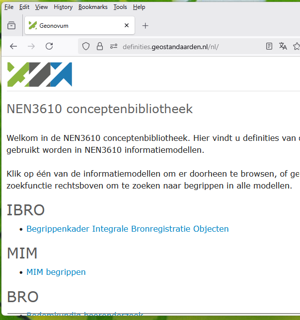

# Begrippenmodel

Bij informatiemodelleren is het maken van een Begrippenmodel [MIM beschouwingsniveau 1](https://docs.geostandaarden.nl/mim/mim/#beschouwingsniveau-1-model-van-begrippen) een belangrijk onderdeel. Hiervoor gebruiken we de [NL-SBB](https://docs.geostandaarden.nl/nl-sbb/nl-sbb/) standaard.

Het begrippenmodel wordt gepubliceerd op: <https://definities.geostandaarden.nl>. 

## Hoe maak ik een begrippenmodel (inhoudelijk)

Een begrippenmodel wordt opgesteld door mensen bij voorkeur voordat er een informatiemodel wordt gemaakt.

**TODO:** best practise zoeken en opnemen.

Hoewel niet wenselijk komt het ook voor dat er achteraf een begrippenmodel wordt gemaakt op basis van een informatiemodel.

## Hoe maak ik een begrippenmodel (technisch)

Een begrippenkader is niet meer dan een SKOS bestand in .ttl formaat. Er zijn verschillende routes om hieraan te komen:

1. Je kunt de [begrippenXL](BegrippenXL.md) editor gebruiken.
2. Een begrippen model is niet veel meer dan een lijst met begrippen en definities. Met een spreadsheet kom je al een heel eind. Dan kun je later naar SKOS converteren.
3. Je kunt de begrippen met Imvertor uit een UML model halen door de optie `createskos = yes` in de configuratie op te nemen. Dit levert een SKOS bestand wat je als tekstbestand kunt editen.

## Regels voor een begrippenmodel binnen Geonovum

**Regel:** Een begrippenmodel is conform [NL-SBB](https://docs.geostandaarden.nl/nl-sbb/nl-sbb/)

**Regel:** We voldoen minimaal aan [Best Practice 1](https://docs.geostandaarden.nl/nl-sbb/nl-sbb/#bp-gangbare-conventies-voor-het-beschrijven-van-termen-voorkeurstermen-alternatieve-termen-zijn) uit NL-SBB.

**Regel:** We voorkomen dat vrijwel dezelfde begrippen in verschillende begrippenkaders voorkomen door [de regels voor harmonisatie en hergebruik uit NL-SBB](https://docs.geostandaarden.nl/nl-sbb/nl-sbb/#harmonisatie-en-hergebruik) toe te passen.

**TODO:** Verdere invulling van [best practices](https://docs.geostandaarden.nl/nl-sbb/nl-sbb/#H5) maken voor Geonovum.

### Regels voor het .ttl bestand

**Regel:** Het .ttl bestand bevat 1 begrippenkader.

**Regel:** De uitleg van het begrippenkader is niet leeg.

### Het publiceren van een SKOS bestand

**Regel:** Begrippenkaders worden in de conceptenbibliotheek gepubliceerd. Deze is te vinden op: <https://definities.geostandaarden.nl>

**Regel:** Bij publicatie wordt de naam van het begrippenkader gebruikt als titel.

**TODO:** Hoe bepaal je het kopje waaronder je bibliotheek terechtkomt? Moet je dat los aanleveren?

Begrippenmodellen die nog niet definitief zijn kun je publiceren op: <https://staging-definities.geostandaarden.nl/>.

Proces voor publicatie:
- Maak een .ttl bestand aan. Stuur het .ttl bestand naar Tanja voor publicatie.
- Automatische publicatie van begrippen op register is nog in ontwikelling door Archi XL.

**Regel:** Bij het publiceren van een definitieve versie moet de staging versie verwijderd worden.