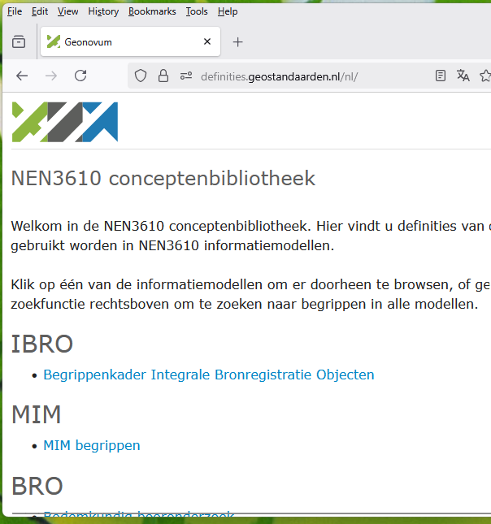

# Begrippenmodel

Bij informatiemodelleren is het maken van een Begrippenmodel [MIM beschouwingsniveau 1](https://docs.geostandaarden.nl/mim/mim/#beschouwingsniveau-1-model-van-begrippen) een belangrijk onderdeel. Hiervoor gebruiken we de [NL-SBB](https://docs.geostandaarden.nl/nl-sbb/nl-sbb/) standaard.

## Hoe maak ik een begrippenmodel (inhoudelijk)

Een begrippenmodel wordt opgesteld door mensen bij voorkeur voordat er een informatiemodel wordt gemaakt.

**TODO:** best practice zoeken en opnemen.

Hoewel niet wenselijk komt het ook voor dat er achteraf een begrippenmodel wordt gemaakt op basis van een informatiemodel.

## Hoe maak ik een begrippenmodel (technisch)

Een begrippenkader is een SKOS bestand in .ttl formaat. Er zijn verschillende routes om hieraan te komen:

Een begrippen model is niet veel meer dan een lijst met begrippen en definities:

1.  Met een spreadsheet kom je al een heel eind. Dan kun je later naar SKOS converteren.
2. Je kunt de begrippen met Imvertor uit een UML model halen door de optie `createskos = yes` in de configuratie op te nemen. Dit levert een SKOS bestand wat je als tekstbestand kunt editen.
3. [Modeldesk](https://app.modeldesk.io) heeft eein ingebouwde begrippeneditor
4. Je kunt de [begrippenXL](BegrippenXL.md) editor gebruiken.

### Het publiceren van een begrippenkader

Een begrippenkader wordt gepubliceerd op <https://definities.geostandaarden.nl>:

Voor hiervoor de volgende stappen uit:

1. Controleer of het begrippenkader voldoet aan de interne kwaliteitseisen in [begrippen-regels.md](regels)
2. Sla het te publiceren bestand op in een git repository. Voorstel maak in het mapje bij een informatiemodel een submap begrippenkader
3. Stuur een link naar Tanja met een verzoek tot publicatie. op de publicatie omgeving <https://definities.geostandaarden.nl> of de staging omgeving <https://staging-definities.geostandaarden.nl/>.
4. Tanja geeft invulling aan het vier-ogen principe door het bestand te controleren of dit uit te besteden aan Frank, Linda of Wilko.
5. Als resultaat wordt het begrippenkader gepubliceerd of je krijgt een melding terug.

**TODO:** Hoe bepaal je het kopje waaronder je bibliotheek terechtkomt? Moet je dat los aanleveren?

**Regel:** Bij het publiceren van een definitieve versie moet de staging versie verwijderd worden.

**TODO:** Goed beschrijven of we verschillende versies van een begrippenkader publiceren.