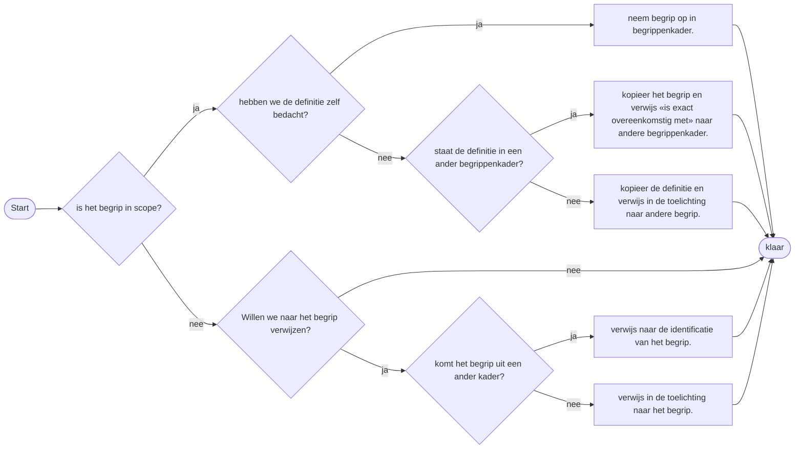

# Werkwijzen voor het maken van een begrippenkader

Stappen in het maken van een begrippenkader

1. Schrijf in een paragraaf de scope op van het begrippenkader.
2. Zorg voor een goede set met bronnen

**Regel:** ALS een begrip elders gedefinieerd is en machine leesbaar
beschikbaar en dit begrip is van belang voor ons kader  DAN nemen we een begrip met deze voorkeursnaam, en zonder
definitie op en verwijzen (SKOS-relatie) we naar het begrip in het andere begrippenkader.

**Regel:** ALS  een begrip gedefinieerd is in een bestaand document (bijv. begrippenkader rijksinspecties als PDF) maar niet machineleesbaar gepubliceerd is DAN publiceren we dit begrip zelf en verwijzen naar de bron.
