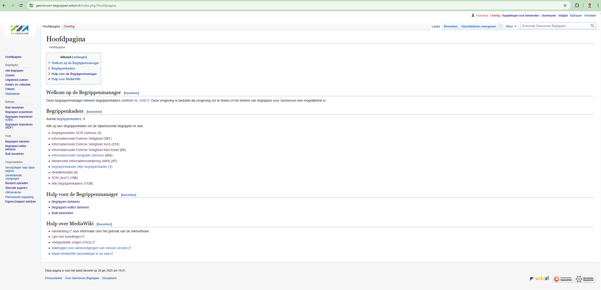
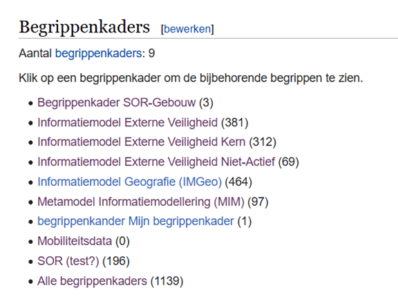
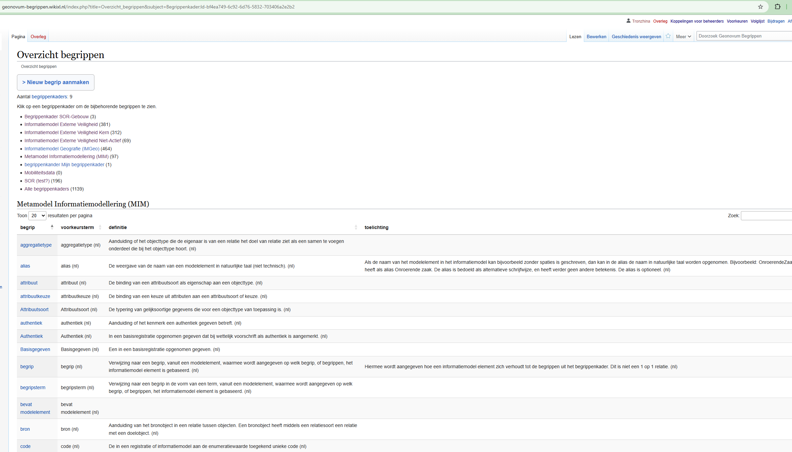
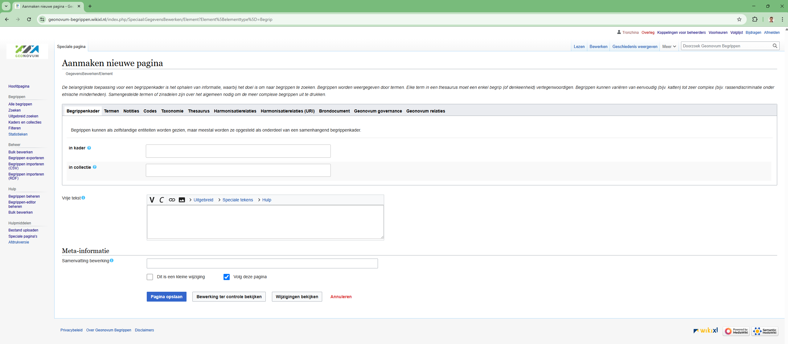
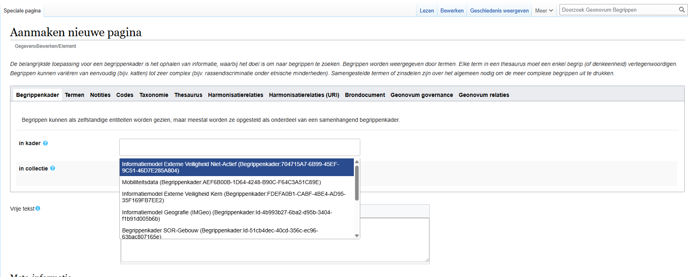
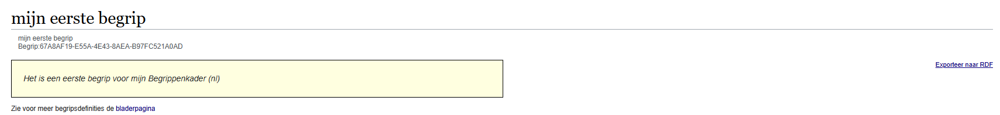
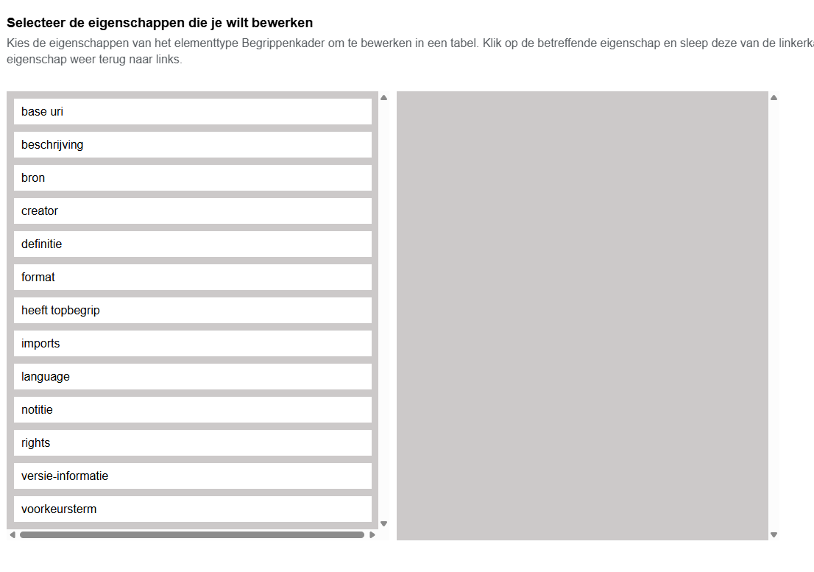
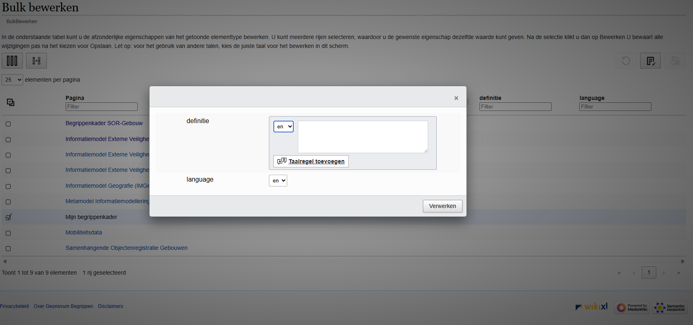

# Begrippen XL

Dit document bevat een beschrijving van het werkproces om begrippen naar de begrippeneditor-website te uploaden en bij te werken.

1. **Toegang** tot de begrippeneditor is nodig. Deze kun je aanvragen bij [Tanja Ronzhina](t.ronzhina@geonovum.nl "email").
2. Een **overzicht** van hoofdpagina van begrippen editor:

    

3. **Begrippen uitzoeken en navigeren binnen een editor:**

Op het gedeelte *Begrippenkaders* van een hoofdpagina staat een overzicht van alle beschikbare begrippenkaders (met het aantal begrippen tussen haakjes).

    

Als je klikt op de naam van de begrippenkader dan je bent redirect naar de pagina met begrippen:
		 

Daar mag je een begrippen controleren, lezen en als nodig een nieuwe begrip aanmaken (klick aan **nieuwe begrip aanmaken**):
			 		

Kies in een "drop-down" menu aan welke kader hoort een nieuwe begrip (hetzelfde voor collectie als nodig).

    

Na het bijwerken van de kader/collectie koppeling termen kunnen worden aangepast. Er zijn verschillende talen beschikbaar (nl, de, en, fr) en het is mogelijk om meer dan één waarde te gebruiken. Daarna notities, codes, taxonomie enz kunnen ook aangepast worden.
	

De uitkomst mag je controleren in een gerelateerd begrippenkader. En als je meer wilt weten over een net gemaakt begrip, klik dan op de naam en je wordt doorgestuurd naar de bijbehorende begrippenpagina.

    

Als je een begrip naar RDF wilt exporteren, klik dan op de exporteerknop voor RDF-tekst op de pagina van het begrip (in het rechterdeel van de pagina).

    
En daarna krijg je een ttl bestand.

    

**4. Creeren van een begrippenkader**

Het is ook mogelijk om een nieuw begrippenkader aan te maken en een naam, notitie, rechten, bron, enz. toe te voegen. Indien nodig kunnen ook eigenschappen op basis van de Dublin Core-ontologie worden toegepast.

    

5. **Bijwerken van begrippen in bulk (bulk bewerken, importeren csv of rdf).**

Om meer dan één begrip/begrippenkader/collectie te wijzigen, moet je speciale tools gebruiken, zoals  **Bulk bewerken** , **CSV importeren** of  **RDF importeren** . Als je een **bulkbewerking** wilt uitvoeren, kun je in een drop-downmenu kiezen welk deel je wilt aanpassen. Een hulp pagina met beschrijving is beschikbaar [hier](https://geonovum-begrippen.wikixl.nl/index.php/Speciaal:BulkBewerken/help)

    

Daarna verschijnt een keuzemenu waarin je kunt aangeven welk deel van het **begrip, begrippenkader of collectie** je wilt bijwerken. Bijvoorbeeld, voor een  **begrippenkader** :

Na je keuze kom je op een bewerkingspagina. Door op het **bewerken-icoon** te klikken (zie rechtsboven in de afbeelding) kun je de gegevens aanpassen.
	

    

**Importeren een csv.**

