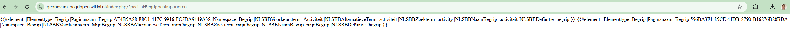

# Begrippen XL

Dit document bevat een beschrijving van het werkproces om begrippen naar de begrippeneditor-website te uploaden en bij te werken.

**NOTE:** De editor is ontwikkeld op basis van WikiXL en SemanticMediaWiki. Het is makkelijker om met BegrippenXL te werken als mensen al bekend zijn met de UI en het overzicht van WikiXL. Voor mensen die deze interface niet kennen, kost het wat tijd om de juiste weg in de editor te vinden. Als je vragen hebt, stel ze dan direct aan Tanja Ronzhina, zonder aarzeling.

## Toegang

De begrippeneditor staat op: [https://geonovum-begrippen.wikixl.nl/](https://geonovum-begrippen.wikixl.nl/)

**Toegang** tot de begrippeneditor is nodig. Deze kun je aanvragen bij [Tanja Ronzhina](mailto:t.ronzhina@geonovum.nl).

## Hoofdpagina

Een **overzicht** van hoofdpagina van begrippen editor:

En overizcht van meeste gebruikend paginas in de editor vind je op de linkse kant van de hoofdpagina:

## Begrippen uitzoeken en navigeren binnen een editor

Op het gedeelte *Begrippenkaders* van een hoofdpagina staat een overzicht van alle beschikbare begrippenkaders (met het aantal begrippen tussen haakjes).

Als je klikt op de naam van de begrippenkader dan je bent redirect naar de pagina met begrippen:

Daar mag je een begrippen controleren, lezen en als nodig een nieuwe begrip aanmaken (klick aan **nieuwe begrip aanmaken**):

Kies in een "drop-down" menu aan welke kader hoort een nieuwe begrip (hetzelfde voor collectie als nodig).

Na het bijwerken van de kader/collectie koppeling termen kunnen worden aangepast. Er zijn verschillende talen beschikbaar (nl, de, en, fr) en het is mogelijk om meer dan één waarde te gebruiken. Daarna notities, codes, taxonomie enz kunnen ook aangepast worden.

De uitkomst mag je controleren in een gerelateerd begrippenkader. En als je meer wilt weten over een net gemaakt begrip, klik dan op de naam en je wordt doorgestuurd naar de bijbehorende begrippenpagina.

Als je een begrip naar RDF wilt exporteren, klik dan op de exporteerknop voor RDF-tekst op de pagina van het begrip (in het rechterdeel van de pagina).

En daarna krijg je een ttl bestand.

## Creeren van een begrippenkader

Het is ook mogelijk om een nieuw begrippenkader aan te maken en een naam, notitie, rechten, bron, enz. toe te voegen. Indien nodig kunnen ook eigenschappen op basis van de Dublin Core-ontologie worden toegepast. Het is de makkelijkste manier op een begrippenkader maken (zonder upload van bestanden).

## Bijwerken van begrippen in bulk (bulk bewerken, importeren csv of rdf)

Om meer dan één begrip/begrippenkader/collectie te wijzigen, moet je speciale tools gebruiken, zoals  **Bulk bewerken** , **CSV importeren** of  **RDF importeren** . Als je een **bulkbewerking** wilt uitvoeren, kun je in een drop-downmenu kiezen welk deel je wilt aanpassen. Een hulp pagina met beschrijving is beschikbaar [hier](https://geonovum-begrippen.wikixl.nl/index.php/Speciaal:BulkBewerken/help)

Daarna verschijnt een keuzemenu waarin je kunt aangeven welk deel van het **begrip, begrippenkader of collectie** je wilt bijwerken. Bijvoorbeeld, voor een  **begrippenkader** :

Na je keuze kom je op een bewerkingspagina. Door op het **bewerken-icoon** te klikken (zie rechtsboven in de afbeelding) kun je de gegevens aanpassen.

## Importeren een csv

Is er een mogelijkheid om begrippen in bulk te importeren (upload csv bestand). Na update van begrippen editor is er ook een mogelikheide om lege csv bestaand te exporteren. Deze bestand heeft alle juiste rijen en colomen dat iemand kan gebruiken als voorbeeld met juiste structuur van velden voor begrippen te schrijven en daarna importeren.

Na importeren van een csv krijg je een deze pagina als je een "dry run " uitgevoerd. Een overzicht van importeerde begrippen

Zonder "dry run" krijg je een vaarschuwing dat een werk is gestart en plaats op een rij en meer gedetaels je mag op job queue viewer vinden.

en in een job queue zie je lijst van taken:

Als upload is klaar dan krijg je een bericht dat begrippen zijn klaar en gedownloaded begrippen je kan zien op de begrippenkader pagina.

Op hetzelfde pagina (begrippen importeren) kan je kieze een import van rdf bestand, uploaden een ingevuld/geschreven ttl bestand met begrippen en(of) begrippenkader.
Het process van importeren is hetzelfde als csv importeren.

## Publiceren op [definities.geostandaarden.nl](https://definities.geostandaarden.nl/nl/)

Het vocabulaire kan je downloaden als .ttl en dat publiceren. Automatische publicatie van begrippen op register is nog in ontwikelling door Archi XL.
