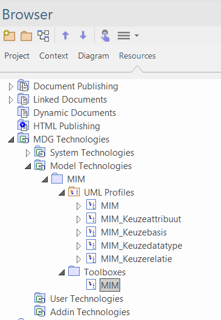

# Enterprise Architect

Instructie voor het gebruik van Enterprise Architect binnen Geonovum:

- Installatie van de software.
- Gebruik van de MIM Toolbox.

## Installatie

- [Enterprise Architect](https://www.sparxsystems.eu/) is via de website te downloaden.
>
> TODO
>

## De MIM toolbox

Externe links: 
- [Handleiding gebruik MIM-toolbox](https://github.com/Geonovum/MIM-Werkomgeving/blob/master/UML%20profieltooling/werkversie1.1.1/README.md)
- [Handleiding genereren MIM-profiel](https://github.com/Geonovum/MIM-Werkomgeving/tree/master/UML%20profieltooling#readme)
- [Handleiding genereren Extensie MIM-toolbox](https://github.com/Geonovum/MIM-Werkomgeving/blob/master/UML%20profieltooling/how_to_extensie_op_toolbox.md)

Stappen:
- Download de MIM Toolbox. Deze is te vinden op: [github](https://github.com/Geonovum/MIM/tree/master/informatiemodel)
- Start Enterprise Architect en open de project browser (Start→Design→Browser)
- Open het resources tabje en klik met de rechtermuis op ‘MDG Technologies’.
- Kies ‘Import Technology’  en importeer de MIM Toolbox.
- Deze is nu zichtbaar onder ‘Model Technologies’:

