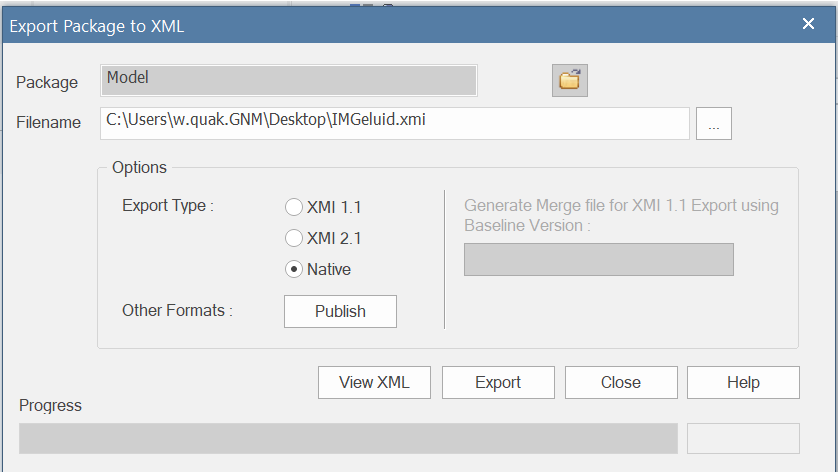

# Enterprise Architect

Binnen Geonovum wordt UML vaak gebruikt als modelleertaal. Enterprise Architect
is de UML editor die we gebruiken.

## Installatie

- Neem voor een licentie contact op met de
  [beheerder](https://stichtinggeonovum.sharepoint.com/:b:/r/sites/FBICT/Gedeelde%20documenten/General/wat%20staat%20waar/Tooling_en_Beheerders.pdf?csf=1&web=1&e=aEcKjl)

Binnen UML maken we vaak gebruik van MIM. Hiervoor moet je de [MIM toolbox importeren](MIM-toolbox-importeren.md)

- [Handleiding gebruik MIM-toolbox](https://github.com/Geonovum/MIM-Werkomgeving/blob/master/UML%20profieltooling/werkversie1.1.1/README.md)
- [Handleiding genereren MIM-profiel](https://github.com/Geonovum/MIM-Werkomgeving/tree/master/UML%20profieltooling#readme)
- [Handleiding genereren Extensie MIM-toolbox](https://github.com/Geonovum/MIM-Werkomgeving/blob/master/UML%20profieltooling/how_to_extensie_op_toolbox.md)

## Exporteren en importeren van XMI

XMI is een uitwisselformaat voor UML modellen. Er zijn heel veel versies:

### Native EA XMI

Dit formaat kan je gebruiken om een UML model met zo weinig mogelijk verlies te delen in gevallen dat het EAPX bestanden delen niet werkt.

#### Export

Open het te exporteren model en selecteer het top package:

In Publish-->Export-XML->Export XML for Current package:

Kies voor Native als Export Type en 'Export'!

