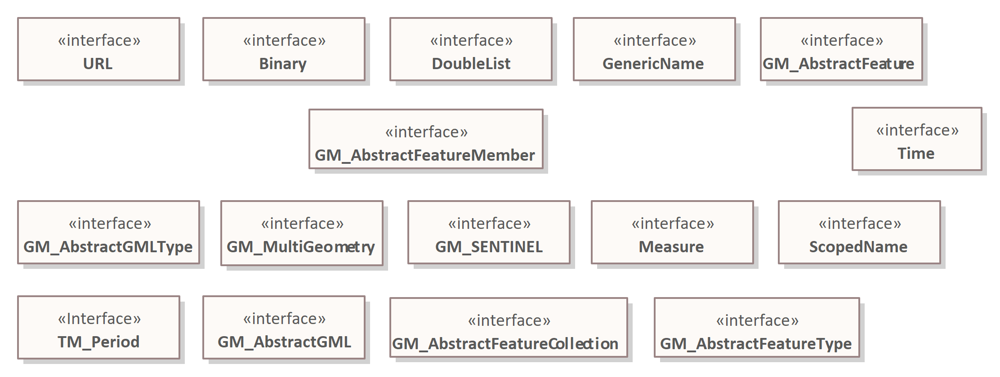

# EA - Gebruik standaarddatatypes (intern)

> **Note** > `@Gerard`: screenshots toevoegen

Bij Geonovum gebruiken we een aantal voorgedefineerde datatypes. Deze zijn
opgedeeld in drie categorieën:

1. MIM11 -- Dit package bevat de datatypes die voorgedefinieerd zijn in het
   [MIM](https://docs.geostandaarden.nl/mim/mim/)
1. Geonovum geometrie -- Dit package bevat de geometrietypes uit
   [ISO19107](https://docs.geostandaarden.nl/nen3610/gimeg/). Deze zijn in een
   los package gestopt zodat andere partijen die alleen geometrie willen
   gebruik deze types kunnen gebruiken,
1. Geonovum algemeen -- In dit package zitten alle overige datatypes die in
   Geonovum UML packages gebruikt worden. Merk op dat in dit package ook wat
   geometrie types zitten; dit zijn types die niet uit ISO-19107 komen. Bij
   voorkeur worden deze niet in de modellering gebruikt.

In: svn.geostandaarden.nl/Datatypes zijn drie collecties met primitieve types
opgenomen die alle primitieve types bevat die in Geonovum UML modellen gebruikt

Deze packages zijn in beheer bij @wilkoquak. Het is de bedoeling dat er in
[Imvertor] een mapping komt die precies overeenkomt het deze drie collecties
types

## Geometrie datatypes

In dit package zitten de geometrische datatypes zoals genoemd in
[ISO19107:2003](https://www.iso.org/standard/26012.html).

## MIM datatypes

In dit package zitten de geometrische datatypes zoals genoemd in
[MIM](https://docs.geostandaarden.nl/mim/mim/#datatypen).

## Geonovum datatypes

In dit package zitten datatypes die niet in de twee eerdergenoemde packages
vallen maar wel ergens gebruikt zijn bij Geonovum.

> **Note** > `@Wilko` wil jij een korte toelichting geven op de driedeling. Wat
> vind je waar en waarom?

Alle basic datatypes binnen UML zouden in één van deze packages moeten staan.
Als dat niet zo is neem dan contact op met `@Wilko`.

Je vindt ze op SVN: `svn://svn.geostandaarden.nl/Datatypes`:

> **Warning** Onderstaande naamgeving klopt niet meer. Dit is door Wilko in
> overleg aangepast. `@Gerard`: graag updaten!

1. `MIM11.xml`
1. `Geonovum-algemeen.xml`
1. `Geonovum-geometrie.xml`

> **Note** Er is nu nog een `Datatyps.xml` waarin alle datatypes zitten deze
> gaat binnenkort verdwijnen.

## Datatypes importeren voor gebruik in EA

Lees hoe je deze types als packages importeert in de handleiding
[SVN - importeren bestaand project](https://github.com/Geonovum/imvertor/blob/main/handleidingen/SVN%20-%20importeren%20bestaand%20project.md).

## Gebruik packages in EA

Deze packages zijn bedoeld voor toepassing binnen een informatiemodel. Het is
niet de bedoeling om de packages in of uit te checken; er hoeven immers geen
wijzigingen in aangebracht te worden.

> **Note** > `@Wilko` en `@Paul`: Eigenlijk zou je hier een beperkt aantal
> mensen schrijfrechten willen geven en de rest alleen lees-rechten. Ik heb
> zoiets nog niet kunnen vinden. `@Gerart`: je kunt dat instellen door in
> configuratiebestandjes op svn.geostandaarden.nl, maar dan moet je daar wel bij
> kunnen.

## Verwijzen naar een datatype

> **Note** > `@Gerard`: In deze paragraaf een uitleg opnemen hoe je vanuit
> Enterprise Architect een voorgedefineerd datatype opneemt bij een
> `«Attribuutsoort»`. |
