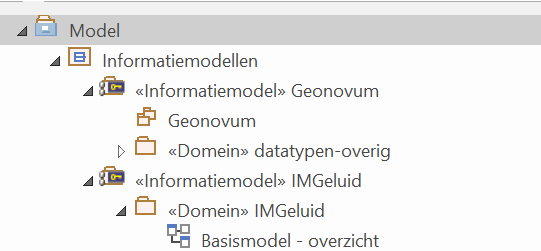
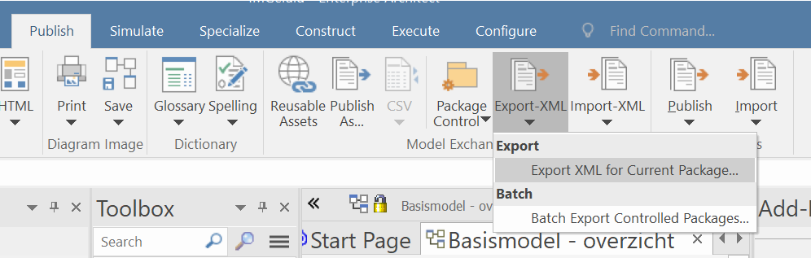
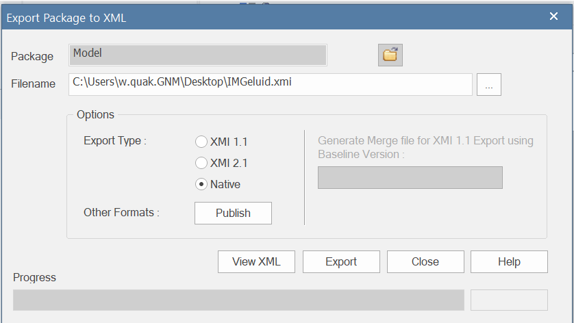

# Enterprise Architect

Binnen Geonovum wordt UML vaak gebruikt als modelleertaal. Enterprise Architect
is de UML editor die we gebruiken.

## Onderwerpen

- Neem voor installatie en licentie contact op met de
  [beheerder](https://stichtinggeonovum.sharepoint.com/:b:/r/sites/FBICT/Gedeelde%20documenten/General/wat%20staat%20waar/Tooling_en_Beheerders.pdf?csf=1&web=1&e=aEcKjl)

Binnen UML maken we vaak gebruik van MIM. Hiervoor moet je de [MIM toolbox importeren](MIM-toolbox-importeren.md)

- [Handleiding gebruik MIM-toolbox](https://github.com/Geonovum/MIM-Werkomgeving/blob/master/UML%20profieltooling/werkversie1.1.1/README.md)
- [Handleiding genereren MIM-profiel](https://github.com/Geonovum/MIM-Werkomgeving/tree/master/UML%20profieltooling#readme)
- [Handleiding genereren Extensie MIM-toolbox](https://github.com/Geonovum/MIM-Werkomgeving/blob/master/UML%20profieltooling/how_to_extensie_op_toolbox.md)

## Handleidingen op andere plekken

| | Applicatie | Naam document | Korte omschrijving | Laatst bijgewerkt | Locatie | Gebruik |
| --- | --- | --- | --- | --- | --- | --- |
| 1 | EA | Handleiding gebruik MIM-toolbox | Deze handleiding beschrijft hoe je de MIM toolbox kunt importeren en toepassen | 2023 | [GitHub](https://github.com/Geonovum/MIM-Werkomgeving/blob/master/UML%20profieltooling/werkversie1.1.1/README.md) | Openbaar |
| 2 | EA | Handleiding genereren MIM-profiel | Deze handleiding beschrijft het proces voor het genereren van een customized toolbox voor modelleren met Enterprise Architect. | 2023 | [GitHub](https://github.com/Geonovum/MIM-Werkomgeving/tree/master/UML%20profieltooling#readme) | Openbaar |
| 3 | EA | Handleiding genereren Extensie MIM-toolbox | Deze handleiding beschrijft hoe je in Enterprise Architect een extensie maakt op de MIM-toolbox. | 2023 | [Github](https://github.com/Geonovum/MIM-Werkomgeving/blob/master/UML%20profieltooling/how_to_extensie_op_toolbox.md) |  Openbaar |
| 12 | EA | Enterprise Architect, profielen en toolboxen | Instructie voor het gebruik van profielen en toolboxen. Gekregen van de BRO (kan waarschijnlijk weg) | 2021 | [Confluence](https://geonovum.atlassian.net/l/cp/YCt6Vi1J) | Intern |

## Exporteren en importeren van XMI

XMI is een uitwisselformaat voor UML modellen. Er zijn heel veel versies:

### Native EA XMI

Dit formaat kan je gebruiken om een UML model met zo weinig mogelijk verlies te delen in gevallen dat het EAPX bestanden delen niet werkt.

#### Export

Open het te exporteren model en selecteer het top package:

In Publish-->Export-XML->Export XML for Current package:

Kies voor Native als Export Type en 'Export'!

