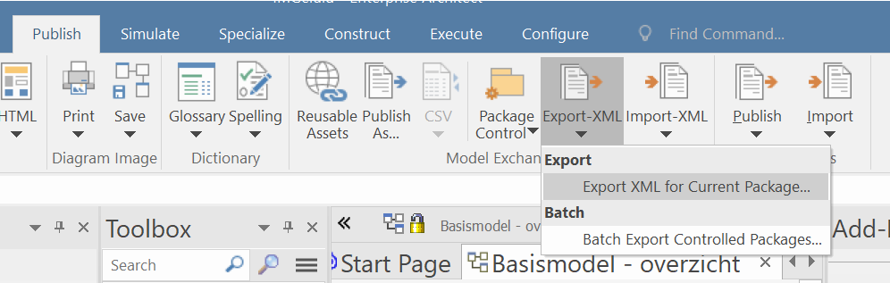
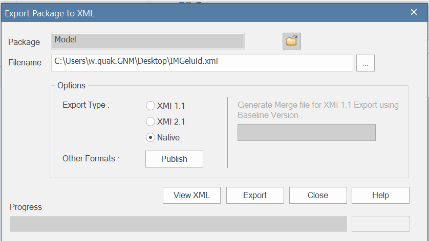

# Exporteren en importeren van XMI

XMI is een uitwisselformaat voor UML modellen. Er zijn heel veel versies:

## Native EA XMI

Dit formaat kan je gebruiken om een UML model met zo weinig mogelijk verlies te delen in gevallen dat het EAPX bestanden delen niet werkt.

### Export

Open het te exporteren model en selecteer het top package:

In Publish-->Export-XML->Export XML for Current package:

Kies voor Native als Export Type en 'Export'!

