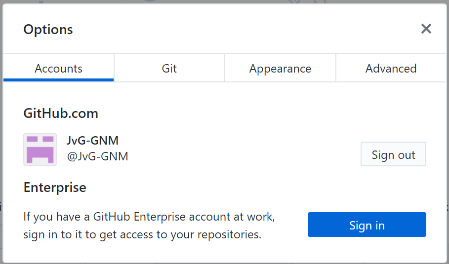
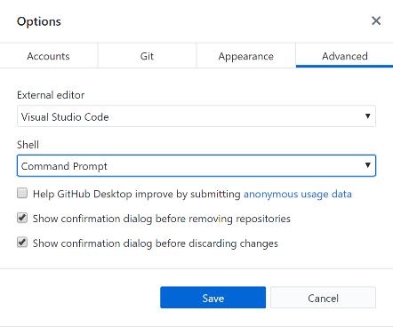
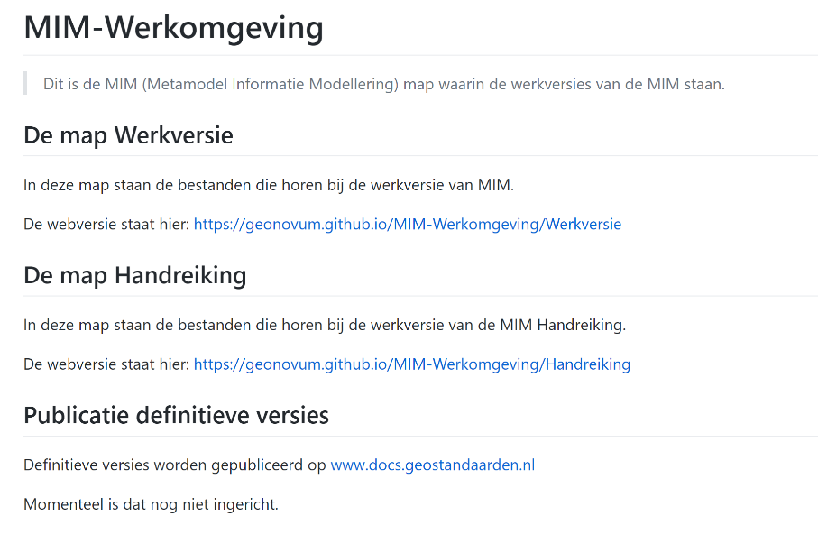
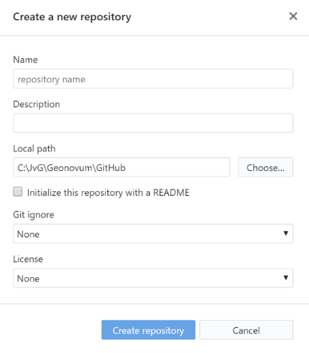

# GitHub

In dit hoofdstuk komen zowel GitHub als GitHub desktop client aan de orde. Geonovum heeft op github een eigen ‘onderkomen’ op: [https://github.com/Geonovum](https://github.com/Geonovum). In dit hoofdstuk staat beschreven wat je moet doen om “up-and-running” te komen voor het uitvoeren van je beheertaken op GitHub. Hoe je een account aanmaakt, en hoe je de benodigde software installeert.

## Installatie en inrichting

### Aanmaken GitHub account

Als je nog geen GitHub account hebt, of als je een apart GitHub account wil
maken voor je Geonovum werkzaamheden, ga naar:
<https://github.com/join/get-started> .

**Tip**: als je met meerdere accounts gaat werken, zorg er dan voor dat aan
de accountnaam kan zien waarvoor die dan gebruikt moet worden. (Bijvoorbeeld
door die naam te eindigen op –GNM). Verplicht is dit niet.

Kies in dit scherm je persoonlijke plan. Bij Geonovum gebruiken we de gratis
versie, dus selecteer die.

### Installeren GitHub desktop

Installeer de gitHub desktop brower vie  <https://desktop.github.com/>:

Na starten van de installer verschijnt het scherm hiernaast

Het volgende scherm zal nu openen

Log in met het eerder aangemaakte account.

Na Klikken op Sign into Github.com, verschijnt dit scherm. Hier hoeft verder niks ingevuld te worden, dus klik op continue.

In dit scherm kan je desgewenst het vinkje bij het versturen van anonieme data uitzetten. Daarna klikken op Finish.

GitHub Desktop is nu geïnstalleerd.

### Opties voor GitHub desktop

GitHub Desktop kan worden aangepast aan persoonlijke voorkeuren. Dat doe je door in het hoofdscherm van de GitHub Desktop op het menu “File” te klikken en vervolgens voor “Opties” te kiezen.

In het Accounts scherm staat hoe je bent ingelogd bij GitHub. Hier kan je uitloggen en opnieuw inloggen als je meerdere GitHub Accounts hebt.

In het tabblad “Git” kan je je Github Naam eventueel aanpassen. De GitHub Email is de email die intern binnen Github wordt gebruikt. Die hoeft niet gewijzigd te worden.

In dit scherm kan je de voorkeurs editor instellen. Default wordt gekeken naar de reeds aanwezige tekst editors. Omdat GitHub van nature een samenwerkomgeving is voor het ontwikkelen van programmatuur, gaat het hier om “platte tekst” editors.

## Werkwijze Geonovum

### De Geonovum GitHub 

Geonovum heeft binnen GitHub twee teams:

| Team                               | Doel                                          |
| ---------------------------------- | --------------------------------------------- |
| <https://github.com/Geonovum>      | Voor het beheren van producten en standaarden |
| <https://github.com/Geonovum-labs> | repositories met open source code, demo's, voorbeelden en experimenten ter ondersteuning van standaarden.                                     |
 
### Mappenstructuur in de respository

In de Repository maak je indien nodig submappen aan. Submappen zijn handig als er in je Repository meer dan één ReSpec document komt te staan. Over ReSpec meer in hoofdstuk 3.

Hiernaast een afbeelding van de GitHub Repository voor MIM. Twee mappen omdat MIM twee documenten bevat.

Ook maakt GitHub standaard een readme.md aan. De readme staat in het “Markdown” formaat, waarover in de volgende paragraaf meer.

### Readme.md

In de readme.md file staat nog eens beschreven Wat de inhoud van de Repository is. Neem ook de link naar de webversie van de documenten hier op, dan is het voor bezoekers gemakkelijker om het document te openen in een browser.

Neem altijd een link naar <a href='https://docs.geostandaarden.nl/' target='_blank'>https://docs.geostandaarden.nl/</a> op, en in het geval het technische documenten betreft zoals UML’s, XSD’s, GML’s, XML’s een link naar <a href='http://register.geostandaarden.nl/' target='_blank'>http://register.geostandaarden.nl/</a> in het Readme bestand op.

## Aan de slag met GitHub

In deze paragraaf een beschrijving van hoe je in GitHub een nieuwe repository aanmaakt, en hoe je die synchroniseert met je lokale GitHub client.

### Het maken van een nieuwe repository

Een nieuwe repository maak je aan in de Centrale GitHub omgeving.

Klik in de banner bovenaan de pagina, naast je profielfoto op “+” en kies “Create Repository”

Nadat je op “+” hebt geklikt, verschijnt het scherm hieronder.

Vul hier de naam van de repository in. Gebruik een naam die kort en bondig is. Zie ook verderop in dit document voor de naamgevingsconventies.

Vul ook de beschrijving in van het project.

Geef als local path de naam van de GitHub map op. GitHub zal dan de naam van de standaard als mapnaam aanmaken onder de lokale GitHub map.

Het is wel zo netjes om een readme file aan te maken, hierin zet je een korte omschrijving van de repository. Klik vervolgens op “Create Repository”

### GitHub Clone: eerste keer ophalen van de centrale repository

Start de GitHub Client, en kies in het menu File voor Clone Repository. En kies de Repository die je wil clonen (in dit geval Geonovum/MIM). Als Local Path kies je een logische plek op je PC/Laptop. (Tip: het is handig om één plek voor je Github Repositories te maken, bijvoorbeeld C:. Na het aanklikken van de knop clone wordt een lokale kopie gemaakt. Github weet welke versie je hebt opgehaald, en zal de wijzingen die je maakt netjes voor je bijhouden.

In de map die je als local path hebt opgegeven komt de mappen structuur te staan zoals hierboven beschreven.

### GitHub Pull origin: ophalen van wijzigingen

Een pull commando werkt de lokale versie van je GitHub Repository bij. Wijzigingen die zijn gedaan in de centrale repository (dus op Github.com) worden ook doorgevoerd in je lokale kopie. Het uitvoeren van een pull doe je door in het menu Repository op pull te klikken.

NB: Voer dit commando regelmatig uit als er meerdere mensen in de repository werken, om conflicterende wijzigingen te voorkomen.

### GitHub Commit to Master: wijzigingen opslaan

Met de knop Commit to master zet je de wijzigingen die je hebt gedaan klaar om te uploaden naar de Centrale GitHub Repository. GitHub maakt daartoe een versie aan,

die je verplicht voorziet van een summary en optioneel van een Description Let op: met

het committen heb je dus nog niks ge-upload.

### GitHub Push origin of Pull request: wijzigingen uploaden

Nadat je de wijzigingen hebt gecommit, moeten ze richting de centrale repository. Nu zijn er twee mogelijkheden. Ofwel je hebt schrijfrechten op de Centrale Repository, of je hebt ze niet. In het eerste geval kan je een Push Origin uitvoeren, dan worden de wijzigingen meteen in de Centrale GitHub Repository verwerkt. In het tweede geval doe je een Pull request bij de eigenaar van de Repository om de wijzigingen door te voeren. Github maakt dan een eigen versie voor je aan (dat heet een fork) en vraagt aan de eigenaar van de Repository om die fork te verwerken in de Centrale Repository.

### Github beheer

- Github teamleden met beheerders rechten zijn te vinden via: <https://github.com/orgs/Geonovum/people?query=role%3Aowner>
- Daarnaast zijn er nog drie inhoudelijk beheerders vanuit Geonovum: Arnoud de Boer, Frank Terpstra en Linda vd Brink.

### Github gebruikers

- Leden van het Geonovum team op GitHub staan op: <https://github.com/orgs/Geonovum/people>.
- Er is geen bezwaar tegen het gebruiken van een privé account binnen de github omgeving.
- Werk je niet meer bij Geonovum wordt je omgezet naar 'External Collaborator'.

### GitHub teams

- Er is een aantal teams gemaakt binnen Geonovum. Deze zijn te vinden op: <https://github.com/orgs/Geonovum/teams>.
- Ieder repository moet aan een team worden toegekend. Het team is aanspreekpunt voor het repository.
- Team namen eindigen op ' team'. Bijvoorbeeld 'DSO team'.

### GitHub organisaties

https://github.com/Geonovum heeft een README.md introtekst met summiere informatie over Geonovum, hoe wij met github werken en verwijzingen naar meer informatie. Deze tekst wordt beheerd in een aparte github repository: https://github.com/Geonovum/.github. 

Daarnaast wordt een landingspagina getoond op https://geonovum.github.io. Dit is (een kopie van) dezelfde tekst. Deze staat ook in een README.md, die wordt beheerd in een andere github repository: https://github.com/Geonovum/geonovum.github.io. 

#### Naamgevingsconventies GitHub

Kies een korte betekenisvolle naam.

De volgende prefixen zijn in gebruik:

| prefix   | omschrijving                                                                                     |
| -------- | ------------------------------------------------------------------------------------------------ |
| dso      | digitale ondersteuning omgevingswet                                                              |
| ow       | omgevingswet. Dit lijkt wel een duplicaat. Laten opgaan in dso-?                                 |
| KP-APIs- | kennisplatform API's.                                                                            |
| xml\_    | Dit was een prefix voor dso repositories maar wordt voor nieuwe repositories niet meer gebruikt. |
| disgeo   | DisGeo                                                                                           |

