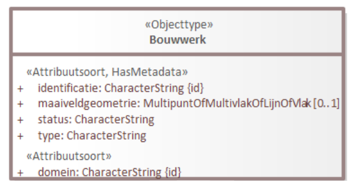

# Handleiding ontologie maken en publiceren

## Inleiding
Naast UML-informatiemodellen en begrippenkaders maakt Geonovum wellicht in de toekomst ook meer ontologieën. Momenteel is er één ontologie gepubliceerd: die van NEN 3610. Hier is gedocumenteerd hoe dat is gedaan.  
 
## Ontologie genereren 

De ontologie is gegenereerd uit het NEN3610-informatiemodel op basis van de regels in MIM.  

 - **Input**: MIM UML-model 
 - **Output**: Ontologie in Turtle (`.ttl`) syntax en documentatie van de ontologie in Markdown (`.md`) syntax (op te nemen in ReSpec-document) 

In je UML-project is daarvoor nodig:  
 - tagged value `baseURI` op packageniveau 


De ontologie is gegenereerd met scripts van Marco Brattinga.  
 - Scripts staan in de repository [NEN3610-werkomgeving](https://github.com/Geonovum/nen3610-werkomgeving/tree/main/model/mim-ld-export)  
 - Het script dat je moet runnen is: `convert.sh`. Dit kun je lokaal doen (onder Windows moet je dit aanroepen in een batch-bestand) of we kunnen dit in een _git workflow_ zetten zodat het script elke keer wordt uitgevoerd als je een EAP-bestand of MIM-XML-bestand pusht. Jesse Bakker heeft dit laatste binnen IMX-Geo gedaan. 
 - Het script genereert met een aantal tussenstappen de uiteindelijke ontologie (RDF-bestand, `.ttl`) en een markdown-bestand (`.md`) met documentatie, dat je in een ReSpec-document kunt opnemen. 

Naast Marco Brattinga hebben Linda, Pano, en Jesse Bakker (Kadaster) kennis van deze scripts. 

## Regels voor de URI 

De URI (in EA: `baseURI`) is de _identifier URL_ van de ontologie. Het is belangrijk dat deze lange tijd stabiel blijft (dus geen _projectnaam_, _organisatienaam_, _versieinformatie_ etc. erin opnemen). Samengevat gelden hiervoor de volgende regels:

 - Moet **beginnen met** `http://modellen.geostandaarden.nl/def/` 
 - Na `/def/`  volgt een **korte naam** 
 - Na de korte naam volgt een `#`  
 - **Geen versie-aanduiding in de URI**

Voorbeeld: `http://modellen.geostandaarden.nl/def/nen3610#` 

> **Note**
>**Waarom geen versie**
>
> Hierover is veel discussie geweest. In de LinkedData-wereld is het de gewoonte om geen versie in de URL te zetten. De **belangrijkste reden** hiervoor is dat de URI een identificatie is. Als deze per versie zou wijzigen, zou dat eigenlijk betekenen dat het een nieuwe ontologie is en dat alles dat erin staat een nieuwe betekenis heeft. Dit is bijna nooit echt wat je wilt.
>
> De klasse `Gebouw` uit NEN3610:2011 is in essentie nog steeds dezelfde als de klasse `Gebouw` uit NEN3610:2022. Mogelijk is de definitie en daarmee populatie een enigszins veranderd. Dat wil zeggen: misschien zit er tussen beide definities een verschil tussen wat je als een gebouw beschouwt. Maar in essentie bedoel je nog steeds hetzelfde, dus verander je dan niet de identificatie.
>
> Een **andere reden** om geen versie in de URI op te nemen is dat dit voorkomt dat je alle data die de ontologie gebruikt, moet updaten als de URI gewijzigd is vanwege een nieuwe versie van de ontologie. 

## Kwaliteitscontrole 

Controleer het gegenereerde .ttl-bestand op correcte syntax met behulp van een [online validator](http://ttl.summerofcode.be).

## Publiceren 

De ontologie is gepubliceerd op http://modellen.geostandaarden.nl 
Beheerders, oa Linda en Pano hebben de FTP-toegang hiervan.  
De ontologie is gepubliceerd in vier bestandsformaten: 
 - HTML (`.html`)
 - Turtle (`.ttl`)
 - RDF/XML (`.rdf`)
 - JSON-LD (`.json`)
 
Het `.ttl`-bestand is automatisch geconverteerd naar RDF/XML en JSON-LD met behulp van een [online conversietool](https://www.easyrdf.org/converter).

### Folderstructuur en rootfolder

De folderstructuur op de webserver is als volgt:  

```
/ 
 index.html 
 .htaccess 
 /def 
   /nen3610 
   /nen36102022 
```

In de _root_ `/` staat een bestand `index.html` dat de content bevat die je ziet in je browser als je naar `http://modellen.geostandaarden.nl` gaat. Dit bestand wordt **handmatig beheerd**. Het moet worden aangepast als er meer ontologieën bij komen.

In de _root_ `/` staat verder een `.htaccess`-bestand. Dat is een webserverscript dat ervoor zorgt dat een verzoek om de ontologie, afhankelijk van de client, de webserver het juiste bestandsformaat laat teruggeven. Als een gebruiker met een webbrowser om `http://modellen.geostandaarden.nl/def/nen3610#` vraagt, geeft de webserver een `html`-bestand terug dat de browser kan tonen en de gebruiker kan lezen. Als een gebruiker met een ontologie-editor vraagt om dezelfde URL, geeft de webserver bijvoorbeeld het `.ttl`-bestand terug.  

Het `.htaccess`-bestand is gemaakt door Linda en Pano en wordt beheerd in github.  

### Ontologie-bestanden op de webserver

De ontologie-bestanden `.ttl`, `.rdf` en `.json` staan in `/def`. De ontologie is zowel als bestand met versieloze bestandsnaam en als bestand met versieaanduiding opgeslagen. NEN3610 gebruikt een _jaartal_, maar _semantic versioning_ is ook toegestaan.
 
```
  /def 
    nen3610.ttl 
    nen3610.rdf 
    nen3610.json 
    nen3610-2022.ttl 
    nen3610-2022.rdf 
    nen3610-2022.json 
```

### HTML-bestanden op de webserver

De `.html`-bestanden staan in twee subfolders, eentje _met_ versieaanduiding en eentje _zonder_. De versieloze folder bevat altijd dezelfde inhoud als de nieuwste versie.  

```
    /nen3610 
     index.html 
    /nen36102022 
     index.html 
```

## Opname in vocabulary catalogus 

En pagina over de NEN3610-ontologie is daarnaast ook op _Linked Open Vocabularies_ (LOV) gepubliceerd, een online catalogus van ontologieën. Dit is aangevraagd via een email naar de beheerders via de contactlink. De beheerders controleren de ontologie en geven tips ter verbetering. NEN3610 staat [hier](https://lov.linkeddata.es/dataset/lov/vocabs/nen3610).

## FAIR ontologie  

Om te zorgen dat de ontologie vindbaar en bruikbaar is, zijn er aanvullende regels. Deze zijn gebaseerd op de regels voor FAIR-ontologieën van _Linked Open Vocabularies_, de vindplaats van ontologieën waar NEN3610 ook in is opgenomen. Hun regels zijn ook beschreven in een goed leesbare paper. De manier waarop de NEN3610-ontologie is gepubliceerd is hierop gebaseerd.

### Metadata 

De volgende metadata dient te worden opgenomen in de ontologie:  

 - Versie-informatie: `owl:versionIRI` en `owl:versionInfo` 
 - `license` (CC-BY) 
 - `creator`, eventueel `contributor`, `creationDate` en (als die bestaat) `previousVersion` 
 - `prefix`, `title` and `description` 
 - `source`: verwijzing naar informatiemodel waar de ontologie op gebaseerd is 
 - `publisher`: verwijzing naar Geonovum

### Vertaling naar het Engels

Het wordt aangeraden om de ontologie te **vertalen naar het Engels** (dit kan in hetzelfde bestand, door verschillende talige labels aan de klassen en eigenschappen te geven). Voor NEN3610 wordt dit overwogen.

### Relatie met andere ontologieën  
Het is _good practice_ om de ontologie te relateren aan andere ontologieën, met name aan NEN3610, GeoSPARQL, OWL Time, de Semantic Sensor Network Ontology (SSN), NEN 2660 etc. Voor NEN3610 is dit nog niet gedaan. Hiervoor zijn een aantal standaardrelaties beschikbaar, zoals;
 - `equivalentClass`
 - `equivalentProperty`
 - `subClassOf`
 - `subPropertyOf`

### Relatie met andere ontologieën in Enterprise Architect
 
In Enterprise Architect is het mogelijk om deze relaties aan te geven. De ontologie-generator zet ze dan ook in de ontologie, maar het mechanisme is nog niet gestandaardiseerd in MIM. De [Generatie MIM-ontologie](https://github.com/Geonovum/WaU-UC3/blob/main/mim2rdf.md) is ontwikkeld in het WaU als onderdeel van het IMX-Geo-project. Om aan te geven dat iets uit je model precies hetzelfde is als iets uit een ander model: Tagged value `uri` bij _klassen_, _attributen_ en _relaties_; gevuld met de URI van de ontologie plus de identifier van de klasse of eigenschap in de ontologie (de MIM naam). Dit wordt vertaald naar `equivalentClass` of `equivalentProperty`. Om aan te geven dat iets een subklasse of -eigenschap is van een klasse of eigenschap uit een ander model, is er nu nog geen methode. 

### Voorbeeld relatie met andere ontologie IMX-Geo en NEN3610



De attributen domein en identificatie komen uit NEN3610.  

`domein` heeft Tagged value:  
```
uri = http: http://modellen.geostandaarden.nl/def/nen3610-2022#domein 
```
 
`identificatie` heeft Tagged value:  
```
uri = http://modellen.geostandaarden.nl/def/nen3610-2022#identificatie  
```