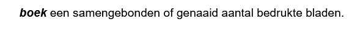

# Definities in ReSpec

> **Note**
> In dit stuk afbeeldingen opnemen waarin je het resultaat in ReSpec kunt zien. Daarvoor graag [NL-ReSpec-template](https://geonovum.github.io/NL-ReSpec-template/) aanvullen.


> **TODO**
> Het zou wel heel leuk zijn om een link met [NL-SBB](https://docs.geostandaarden.nl/nl-sbb/nl-sbb/) te leggen.

## Intro

Een belangrijk onderdeel van een dataspecificatie is de definitie van begrippen. Steeds vaker leggen we bij Geonovum begrippen vast in een [begrippenkader](https://definities.geostandaarden.nl/nl/). Idealiter zouden we voor de definitie van een begrip altijd daarnaar willen verwijzen. Op dit moment is dat om meerdere redenen nog niet mogelijk. Op deze plek leggen we uit hoe we nu een definitie opnemen.

## Definitie van een begrip opnemen in specificatie

De meeste begrippen in een dataspecificatie worden gedefinieerd in het hoofdstuk _Gegevensdefinitie_. Imvertor genereert dit hoofdstuk automatisch op basis van het model in EA. Deze beschrijving richt zich alleen op de hoofdstukken die met de hand geschreven worden.

De [beschrijving in de handleiding van ReSpec](https://respec.org/docs/#definitions-and-linking) is heel summier. Hierdoor pas je het snel en eenvoudig toe, maar het leidt niet vanzelfsprekend tot éénduidig gebruik. Er zijn namelijk verschillende manieren waarop je als gebruiker een begrip met definitie kunt opnemen:

1.  inline
1.  losse regel
1.  lijst

Binnen Geonovum willen we dit meer kaderen. Daarnaast hebben we aanvullende eisen ten aanzien van de weergave.

> **Warning**
> Blokweergave en 'normale' weergave niet door elkaar gebruiken. Als je het script gebruikt gaat dat niet goed. Dat kan aangepast worden, maar het is bovenal niet wenselijk om verschillende stijlen in één document toe te passen.

### Weergave

ReSpec toont een gedefinieerd begrip door de term schuin en dikgedrukt weer te geven. Deze styling is niet voor elk doeleinde geschikt. Voor inline- en lijstweergave werkt dit prima, maar als losse regel weer niet. Daar mist styling. Toch is dat soms wenselijk, zoals in het MIM-document. Hiervoor is een aanvulling gemaakt op ReSpec, die je kunt gebruikern door [`nog invullen`].

#### Volgens ReSpec

```markdown
<dfn>boek</dfn>een samengebonden of genaaid aantal bedrukte bladen.
```

##### Resultaat



##### Gebruik van definitie

Wil je naar een gedefinineerd begrip verwijzen gaat dat zo: `<a>boek</a>`` of `[=boek-]`

#### Aanvullende styling

wrap een definitie in een aside met attribute class="definition"

```html
<aside class="definition">
    <dfn>papier</dfn>stof om te beschrijven of bedrukken, uit vezelachtige
    stoffen, hout, lompen, stro enz. vervaardigd
</aside>
```

##### Resultaat

[`afbeelding opnemen`]

<!-- In guide NL-ReSpec-template ook css voor dfn-box opnemen. Die gebruikt `<aside>` met extra attribuut, dus dan kan ik voorbeeld met en voorbeeld zonder attribuut laten zien -->

> **Warning**
> Een begrip mag maar één keer voorkomen; je kunt een term niet op twee verschillende manieren definiëren.

<!-- Maar het komt ook voor dat je losse termen op verschillende plekken in je document wilt definieren. Dus niet in lijstvorm -->

> **Warning**
> Hier graag zoveel mogelijk één lijn in trekken. Graag voorbeelden van hoe dat in huidige documenten zit.

## Verwijzing maken naar gedefinieerd begrip

Als je op andere plekken in je document wilt verwijzen naar een gedefinieerd begrip, dan kan dat eenvoudig door het begrip tussen `<a></a>` te zetten, bijv:  `<a>boek</a>`. Houd als richtlijn dat je alleen de eerste keer dat een term in een alinea voorkomt een verwijzing maakt. Dit voorkomt een overdaad aan verwijzingen in de tekst. Een verwijzing naar een term werkt in alle gevallen hetzelfde.

<!-- ## Wanneer zelf term definieeren, wanneer verwijzen naar

Index
Begrippen gedefinieerd door deze specificatie
https://respec.org/docs/#definitions-and-linking

Begrippen gedefineerd door verwijzing.
https://respec.org/docs/#referencing-terms-from-other-specifications

bladzijde
één kant van een blad uit een boek, krant, tijdschrift enz.

kaft
papieren omslag om een boek of schrift -->
