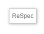
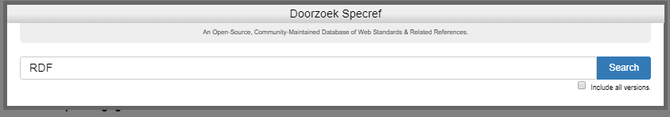
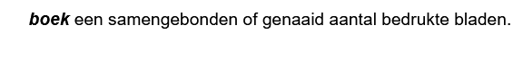

# Onderdelen van een ReSpec document

## De URL van een publicatie op docs.geonovum.nl

ReSpec documenten worden gepubliceerd op
[docs.geostandaarden.nl](https://docs.geostandaarden.nl). Iedere gepubliceerde
versie van een document heeft een eigen URL. Voor de laatst gepubliceerde versie
is een aparte URL.

De URL van iedere publicatie wordt als volgt bepaald:

```text
https://docs.geostandaarden.nl/[pubdomain]/[specStatus]-[spectype]-[shortName]-[publishDate]/
```

De laatst gepubliceerde versie is OOK te vinden op:

```text
https://docs.geostandaarden.nl/[pubdomain]/[shortName]/
```

De namen van de variabelen staan verderop uitgelegd.

## De bestanden van een ReSpec repository

### Het bestand 'index.html'

Het bestand index.html zorgt ervoor dat het ReSpec document automatisch wordt
geladen in de browser. Bij het laden wordt ook automatisch de
geonovum-ReSpec-code geladen en uitgevoerd. Deze code zorgt ervoor dat het
document zijn standaard layout krijgt.

Het bestand 'index.html' heeft een vaste indeling.

In de HTML-header wordt de js-ReSpec bibliotheek geladen. Het enige dat in de
header mag worden aangepast is de title (tussen \<title\> en \</title\>.

In de HTML-Body geldt _vrijheid in gebondenheid_ De `<div>` en/of `<section>`
regels mogen worden gekopieerd en toegevoegd. Wel belangrijk om de structuur
over te nemen, dus als volgt:

```html
<div id='H00' data-format='Markdown' data-include="ToCoVo.md"></div>
<section id='H01' data-format='Markdown' data-include="H1-Inleiding.md"\>\<h2\>Inleiding\</h2\>\</section\>
```

Een `<div>` is een sectie plus bijbehorend document, dat niet in de
inhoudsopgave terechtkomt. Deze gebruik je bijvoorbeeld voor een Toelichting,
een Colofon of een Voorwoord.

Een `<section>` komt wél in de inhoudsopgave terecht. Deze heeft daarom behalve
de data-include van het document, ook (verplicht!) een `<h2>` tag. De tekst
tussen `<h2>` en `</h2>` komt in de inhoudsopgave te staan.

### Het bestand 'js/config.js'

In config.js wordt een stuurvariabele voor ReSpec gevuld. De waarden in deze
variabele worden door ReSpec gebruikt om de layout te bepalen, en bevatten een
aantal document-eigenschappen.

### SpecStatus

**Bron:** <https://github.com/Geonovum/tools.geostandaarden.nl/blob/main/tools.geostandaarden.nl/respec/config/geonovum-config.js>

De SpecStatus in de configuratie geeft de keuze uit 4 waarden, deze waarden zijn
vastgesteld, en mogen niet zomaar uitgebreid of aangepast worden. Elke status
hoort bij een formele fase van een ReSpec document. Zie ook de Geonovum ReSpec
[wiki](https://github.com/Geonovum/respec/wiki).

- **wv**, Werkversie: Dit is de versie van het document waaraan wordt
  gewerkt. Deze versie is continu 'under-construction'.
- **cv**, Consultatieversie: Dit is een 'snapshot' van de versie die 'in
    consultatie' wordt gezet. Aan deze versie wordt niks meer gedaan totdat de
    consultatie is afgelopen. Daarna worden alle op en aanmerkingen uit de
    consultatieronde verwerkt.
- **vv**, Vaststellingsversie: Dit is een 'snapshot' van de versie na het
    verwerken van de op en aanmerkingen uit de consultatieronde is ontstaan.
    Deze versie wordt aangeboden aan de programma-raad van Geonovum, om te
    worden 'vastgesteld'.
- **def**, Definitieve versie: Dit is de definitieve versie van het document,
    zoals vastgesteld door de programma-raad. Van deze versie wordt opnieuw een
    'snapshot' gemaakt in ReSpec. Het resultaat van die snapshot wordt op
    <http://docs.geonovum.nl> neergezet.
- **ld**, Levend document: Geschikt voor handreikingen en dergelijke die
  regelmatig gewijzigd worden en waarvoor niet een consultatie- en
  goedkeuringsproces gevolgd hoeft te worden
- **basis**, document zonder officiële status.

### SpecType

**Bron:** <https://www.geonovum.nl/uploads/documents/Geonovum%20GENERIEK%20Beheerplan%20geo-standaarden%20v1.1.pdf>

Het SpecType in de configuratie is een vaste lijst met waarden, deze waarden
zijn vastgesteld, en mogen niet zonder overleg met de Technische ReSpec
beheerders uitgebreid of aangepast worden.

- **NO** Norm: Een norm is bij een officieel standaardisatie instituut
    ondergebracht en bevat bindende afspraken. Naast het gebruik van normen is
    NEN 3610 de enige norm waar Geonovum een inhoudelijke verantwoordelijkheid
    heeft. Het formele beheer en beslissingen worden genomen in de NEN
    normcommissie 351 240 waar Geonovum de voorzitter van is.

- **ST** Standaard: Een document met (bindende) afspraken.

- **IM** Informatiemodel: Een standaard waarbij door de term informatiemodel
    te hanteren wordt aangegeven dat het een abstractie (het model) vormt van de
    werkelijkheid zoals beschreven binnen een bepaalde sector/domein.
    Informatiemodellen zijn een semantische invulling van normen voor sectoren
    zoals ruimtelijke ordening, kabels en leidingen, water, etc..

- **PR** Praktijkrichtlijn: Praktijkrichtlijnen zijn producten die informatie
    geven, vaak met een technisch karakter, die nodig is voor het toepassen van
    standaarden. Een praktijkrichtlijn hoort altijd bij een standaard/norm.

- **HR** Handreiking: Op zichzelf staande documentatie dat als doel heeft een
    hulpmiddel te zijn, niet verplichtend maar ondersteunend.

- **WA** Werkafspraak: Legt uit hoe wetgeving moet worden toegepast bij
    onduidelijkheden, discrepanties of fouten in de standaarden.

- **BD** Beheerdocumentatie: Documentatie met betrekking tot het beheerproces
    van de standaard. Deze documentatie betreft niet een standaard of onderdeel
    daarvan, zoals een handreiking of werkafspraak.

- **AL** Algemeen: Op zichzelf staande algemene documentatie over standaarden.
    De documentatie betreft niet een specifieke standaard of onderdeel daarvan,
    het is ook geen beheerdocumentatie van een specifieke standaard.

### pubDomain

pubDomain bepaalt bij publicatie een deel van de URL waarop het document wordt
gepubliceerd. Het zorgt voor een groepering van de documenten op
docs.geostandaarden.nl Omdat je de URL van gepubliceerde documenten niet wilt
veranderen is moet je hier goed over nadenken en alleen in overleg nieuwe
toevoegen.

De actuele lijst van pubDomains staat in de tabel hieronder. De herkomst van
deze lijst is als volgt:

1. Lijst op github :
   [respec-utils](https://github.com/Geonovum/respec-utils/blob/master/src/autodeploy/config/pubDomainList.json).
2. docs.geostandaarden.nl.
3. register.geostandaarden.nl.

**Regel:** een pubdomain mag geen hoofletters of spaties bevatten.


| Pubdomain      | Omschrijving                                             | Herkomst                   | status                    | GitHub Team                                                   | Beslissing                              |
| -------------- | -------------------------------------------------------- | -------------------------- | ------------------------- | ------------------------------------------------------------- | --------------------------------------- |
| 3dbv           | 3D basisvoorziening                                      | docs.geostandaarden.nl     | inactief (gemigreerd)     |                                                               | mag niet meer gebruikt worden           |
| api            | Kennisplatform APIs                                      | respec utils               |                           | [API team](https://github.com/orgs/Geonovum/teams/api-team)   | OK                                      |
| basisgeometrie | Informatiemodel Basisgeometrie                           | register.geostandaarden.nl | zit op docs bij nen3610   |                                                               | niet gebruiken eigenlijk xsd redirecten |
| bgt            | Basisregistratie grootschalige topografie                | docs.geostandaarden.nl     |                           | [BGT team](https://github.com/orgs/Geonovum/teams/bgt-team)   | Arnoud vragen                           |
| brt            | Informatiemodellen Basisregistratie Topografie           | register.geostandaarden.nl |                           | [BRT team](https://github.com/orgs/Geonovum/teams/brt-team)   | OK                                      |
| crs            | Coördinaatreferentiesystemen                             | docs.geostandaarden.nl     |                           | [CRS team](https://github.com/orgs/Geonovum/teams/crs-team)   | OK                                      |
| cvgg           | Informatiemodel Geluid                                   | docs.geostandaarden.nl     | duplicaat van img         |                                                               | OK                                      |
| disgeo         | DisGeo                                                   | respec utils               |                           |                                                               | OK                                      |
| dsgo           | Digitaal Stelsel Gebouwde Omgeving                       | docs.geostandaarden.nl     |                           |                                                               | OK (rare uri)                           |
| dso            | Digitaal Stelsel Omgevingswet                            | respec utils               | duplicaten: tpod imow ow  | [DSO team](https://github.com/orgs/Geonovum/teams/dso-team)   | OK                                      |
| eu             |                                                          | docs.geostandaarden.nl     |                           | [EU team](https://github.com/orgs/Geonovum/teams/eu-team)     | OK (rare uri en werkversie weg)         |
| g4w            |                                                          | docs.geostandaarden.nl     |                           |                                                               | groeperen?                              |
| gbd            |                                                          | docs.geostandaarden.nl     |                           |                                                               | groeperen?                              |
| geobag         |                                                          | docs.geostandaarden.nl     |                           |                                                               | OK                                      |
| gsw            |                                                          | docs.geostandaarden.nl     |                           |                                                               | groeperen?                              |
| imaer          | Informatiemodel AERIUS                                   | register.geostandaarden.nl |                           |                                                               | OK                                      |
| imev           | Informatiemodel Externe Veiligheid                       | docs.geostandaarden.nl     |                           | [IMEV team](https://github.com/orgs/Geonovum/teams/api-team)  | OK                                      |
| img            | Informatiemodel Geluid                                   | respec utils               | duplicaat: cvgg           | [IMG team](https://github.com/orgs/Geonovum/teams/img-team)   | redirecten naar cvgg                    |
| imgeo          | Informatiemodel Grootschalige Geografie                  | docs.geostandaarden.nl     |                           |                                                               | Arnoud vragen                           |
| imka           | Informatiemodel Klimaatadaptatie                         | docs.geostandaarden.nl     |                           |                                                               | OK                                      |
| imkad          | Informatiemodel Kadaster                                 | register.geostandaarden.nl |                           | [IMKA team](https://github.com/orgs/Geonovum/teams/imka-team) | OK                                      |
| imkl           | Informatiemodel Kabels en Leidingen                      | register.geostandaarden.nl | duplicaat: kl             | [IMKL team](https://github.com/orgs/Geonovum/teams/imkl-team) | Zou kl moeten worden                    |
| imle           |                                                          | docs.geostandaarden.nl     |                           |                                                               | OK (niet netjes gepubliceerd)           |
| imro           | Informatiemodel Ruimtelijke Ordening                     | register.geostandaarden.nl | duplicaat: ro             |                                                               | liefst naar RO                          |
| imow           | Informatiemodel Omgevingswet                             | register.geostandaarden.nl | duplicaten: tpod ow dso   |                                                               | liefst weg                              |
| kl             | IMKL                                                     | respec utils               | duplicaat: imkl           |                                                               | OK                                      |
| md             | Metadata                                                 | respec utils               | duplicaat: metadata       |                                                               | OK                                      |
| mim            | Metamodel Informatie Modellering (MIM                    | respec utils               |                           |                                                               | OK                                      |
| metadata       | Nederlandse metadata profielen voor datasets en services | register.geostandaarden.nl | duplicaat: md             |                                                               | verplaatsen naar md??                   |
| nen3610        | NEN3610-Linkeddata                                       | respec utils               |                           |                                                               | OK                                      |
| ngii           |                                                          | docs.geostandaarden.nl     |                           |                                                               | OK                                      |
| oov            |                                                          | docs.geostandaarden.nl     |                           |                                                               | OK                                      |
| ow             | Standaarden omgevingswet                                 | respec utils               | duplicaten: tpod imow dso |                                                               | OK                                      |
| ro             | RO Standaarden                                           | respec utils               | duplicaat: imro           |                                                               | OK                                      |
| rwgs           | Raamwerk van Geo-standaarden                             | respec utils               |                           |                                                               | groeperen?                              |
| serv           | Services                                                 | respec utils               |                           |                                                               | groeperen?                              |
| tpod           | Toepassingsprofiel omgevingsdocumenten                   | respec utils               | duplicaten: ow imow dso   |                                                               | OK                                      |
| vg             | Informatiemodel Vastgoedgebruik                          | respec utils               |                           |                                                               | OK                                      |
| visu           | Visualisatie                                             | respec utils               |                           |                                                               | groeperen?                              |
| vtm            |                                                          | docs.geostandaarden.nl     | is eigenlijk metadata     |                                                               | verhuizen naar MD                       |
| wp             | Whitepaper Geostandaarden                                | respec utils               | ook een raar pubdomain    |                                                               | verhuizen naar ngii                     |


## shortName

Korte identificatie van het document die gebruikt wordt in de URL.

**Regel:** shortName mag geen uppercase letters bevatten.


## Bibliografie

ReSpec maakt automatisch een literatuurlijst van alle documenten waarnaar
je verwijst. Een normatieve verwijzing naar een document ziet er als volgt uit

```markdown
we gebruiken [[SemVer]] voor het nummeren van versies.
```

De referentie in dubbele blokhaken wordt op drie niveaus gezocht:

- Een globale lijst is te vinden op: [SpecRef](https://www.specref.org/).
- Een Geonovum brede lijst is te vinden op: [https://tools.geostandaarden.nl/specref/](https://tools.geostandaarden.nl/specref/). Deze lijst wordt beheerd via: <https://tools.geostandaarden.nl/respec/config/geonovum-config.js>.
- In de lokale `config.js` kan je lokale referenties toevoegen

Bij verwijzingen kan je kiezen of ze normatief zijn of niet. In
de referenties onderaan worden twee lijsten getoond. 
Of een referentie normatief is of niet hangt ervanaf of het hoofdstuk
normatief is of niet. Per referentie kan het ook instellen door een 
uitroepteken of vraagteken voor de verwijzing zetten te zetten `[[!ID]]` of `[[?ID]]`.

## Content: markdown bestanden

De 'echte' content wordt gemaakt in het formaat 'Markdown'. Er is een aantal
editors beschikbaar die dat formaat ondersteunen. Maak van elk hoofdstuk
een aparte Markdown file.

## Afbeeldingen

Afbeeldingen worden als '.png' of '.svg' bestand neergezet in de map 'media'.

## ReSpec Frontend

### De knop 'ReSpec'

De knop 'ReSpec' rechtsboven in de frontend van ReSpec, bevat een aantal
functies. Als je klikt op de knop, verschijnt het vervolgscherm met een viertal
functies.

Elk van de functies wordt hieronder uitgelegd.



### Bewaar snapshot


### Doorzoek SpecRef

 

De gevonden zoekresultaten kunnen worden overgenomen in het ReSpec document.

## HTML ingebed in ReSpec

Omdat wij ervoor hebben gekozen om documenten te schrijven in Markdown,
gebruiken wij niet alle ReSpec functionaliteit. In dit hoofdstuk worden de
speciale ReSpec functies beschreven die als HTML code in het Markdown document
kunnen wordnen opgenomen, of die in de door respec gegenereerde HTML file kunnen
worden neergezet. Het gebruik van deze functionaliteit vereist dus wel HTML
kennis.

## HTML voor Afbeeldingen

Een lijst van afbeeldingen kan door ReSpec automatisch worden gegenereerd, maar
dan moet er wel aan een aantal ReSpec specifieke voorwaarden worden voldaan:

In Index.html komt ergens te staan:

```html
<figure id="flowchart">
   
   <figcaption>The water flows from bucket A to bucket B.</figcaption>
</figure>
```

In de documenten worden de afbeeldingen op de volgende manier neergezet:

```html
<figure id="flowchart">
   
   <figcaption>The water flows from bucket A to bucket B.</figcaption>
</figure>
```

NB: `<figure>` inclusief uniek ID en een ge-embedde `<figcaption>` zijn
verplicht!

Eventuele referenties naar plaatjes doe je op e volgende manier:

```html
<p>The flowchart shown in <a href="#flowchart"></a> is quite impressive.</p>
</section>
```

## Referentie naar GitHub issues

ReSpec ondersteunt ook een koppeling naar issues die zijn gemeld op GitHub. Jek
kan referenties opnemen naar individuele issues. Ook is het mogelijk om een
lijst met alle issues op te nemen in je document.

Om GitHub issues op te nemen moet je in 'config.js' een referentie opnemen naar
de GitHub repository.

```html
issueBase: "https://github.com/Geonovum/MIM-Werkomgeving/issues/"
```

Een referentie naar een issue neem je als volgt op:

```html
<div class="issue" data-number="363"></div>
```

Waarbij data-number het issuenummer is.

Een lijst met issues kan je toevoegen met de volgende HTML code:

```html
<section class="appendix" id="issue-summary">
  <!-- Issues will magically be listed here! -->
</section>

```


## Definities in ReSpec

Een  onderdeel van een dataspecificatie is de definitie van begrippen. Steeds vaker leggen we bij Geonovum begrippen vast in een [begrippenkader](https://definities.geostandaarden.nl/nl/). Idealiter verwijs je voor de definitie van een begrip altijd daarnaar. Op deze plek leggen we uit hoe we nu een definitie opnemen.

### Definitie van een begrip opnemen in specificatie

In een informatiemodel worden veel begrippen gedefinieerd in de met Imvertor gemaakte catalogus. In andere hoofdstukken worden ook begrippen gedefinieer. Deze handleiding gaat hierover

De [beschrijving in de handleiding van ReSpec](https://respec.org/docs/#definitions-and-linking) is heel summier. Hierdoor pas je het snel en eenvoudig toe, maar het leidt niet vanzelfsprekend tot éénduidig gebruik. 

Een definitie wordt als volgt gemaakt:

```markdown
<dfn>boek</dfn>een samengebonden of genaaid aantal bedrukte bladen.
```

Het resultaat ziet er zo uit:



### Gebruik van definitie

Wil je naar een gedefinineerd begrip verwijzen gaat dat zo: `<a>boek</a>`` of `[=boek-]`

Houd als richtlijn dat je alleen de eerste keer dat een term in een alinea voorkomt een verwijzing maakt. Dit voorkomt een overdaad aan verwijzingen in de tekst.

### Aanvullende styling

wrap een definitie in een aside met attribute class="definition"

```html
<aside class="definition">
    <dfn>papier</dfn>stof om te beschrijven of bedrukken, uit vezelachtige
    stoffen, hout, lompen, stro enz. vervaardigd
</aside>
```

### Resultaat

[`afbeelding opnemen`]

> **TODO**
> Het zou wel heel leuk zijn om een link met [NL-SBB](https://docs.geostandaarden.nl/nl-sbb/nl-sbb/) te leggen.


## ReSpec - richtlijn code in tekst

In de tekst gebruik je regelmatig stukken code, in de lopende tekst (_inline code_), of  langere stukken code (_code block_). Deze handleiding is specifiek bedoeld voor de toepassing van code in documentantatie over informatiemodellen. Voor andere type code staat het je vrij hoe je dit toepast.

### Inline code

Wanneer je in een lopende tekst een term of gegeven wilt markeren als code, pas je _inline code_ toe. Door een term of gegeven als `code` te markeren, maak je duidelijk dat het woord een specifieke technische betekenis heeft. _Inline code_ pas je toe door tekst tussen [backticks](https://en.wikipedia.org/wiki/Backtick) (`` ` ``) te plaatsen. De standaardopmaak voor _inline code_ is sober: ReSpec zet het lettertype enkel om in een _monospace font_. Voor een duidelijkere opmaak van _inline code_, is daarom een [css-bestand beschikbaar](https://github.com/Geonovum/NL-ReSpec-GN-beheer/blob/main/css/inline-code.css). De schrijfwijze van metaklassenamen, modelelementnamen of gegevens volgt de [naamgevingsconventies van het MIM](https://geonovum.github.io/MIM-Werkomgeving/#afspraken-rondom-naamgeving-en-definities). Wees hierop alert als je _inline code_ toepast in handgeschreven teksten. 

#### Metaklassenaam

Pas deze notatie toe als je een modelelement (in UML: stereotype) uit een metamodel opneemt in de lopende tekst. Geonovum past het metamodel informatiemodellering (MIM) toe, maar de onderstaande richtlijn kan ook toegepast worden op modelelementen uit een ander metamodel. Enkele voorbeelden van modelelementen uit het MIM zijn:

 - `«Objecttype»`
 - `«Attribuutsoort»`
 - `«Relatiesoort»`

Plaats voor deze notatiewijze naam van de metaklasse tussen twee dubbele _guillemets_ `«`, `»`. Je vindt ze met de volgende toetsencombinaties:

 - `«` = `"alt"` + `"["`
 - `»` = `"alt"` + `"]"`

In markdown neem je een metaklassenaam als volgt op:
`` `«metaklassenaam»` ``. 

#### Modelelementnaam

Pas deze notatie toe als je de naam van een modelelement van een informatiemodel opneemt in de lopende tekst. Het gaat dan bijvoorbeeld om de naam van een `«Objecttype»` of `«Attribuutsoort»` in een specifiek domeinmodel, zoals bijvoorbeeld:

 - `Pand` (`«Objecttype»`)
 - `Persoon` (`«Objecttype»`)
 - `naam` (`«Attribuutsoort»`)
 - `geboortedatum` (`«Attribuutsoort»`)
 - `geometrie` (`«Attribuutsoort»`)
 - `VlakOfMultivlak` (`«Keuze»`)

In  markdown neem je een metaklassenaam als volgt op:
`` `modelelementnaam` ``.

#### Gegeven

Pas deze notitie toe als je een feitelijk of fictief gegeven opneemt in de lopende tekst. Het gaat om concrete waarden zoals die in een registratie (kunnen) voorkomen, zoals: 

 - `"Jan"`
 - `"01-01-1970"`
 - `"234.5"`
 - `"[125.6, 10.1]"`

Specifiek in de context van het MIM, gaat het om waarden die ingevuld (kunnen) worden bij de volgende modelelementen:

 - `«Attribuutsoort»`
 - `«Gegevensgroeptype»`
 - `«Relatiesoort»`
 - `«Relatieklasse»`
 - `«Data-element»`
 - `«Referentie-element»`
 - `«Enumeratie-waarde»`

In het markdown-bestand neem je een metaklassenaam als volgt op:
`` `"gegeven"` ``.

#### Voorbeeld: gecombineerde inlinecodetypen

Stel je wilt in een tekst de volgende zin opnemen:

>Het model bevat een objecttype persoon met een attribuutsoort naam met het gegeven: Jan én een attribuutsoort geboortedatum met het gegeven: "01-01-1970".

Dan ziet die zin er, na toepassing van bovenstaande richtlijnen er als volgt uit:

>Het model bevat een `«Objecttype»` `Persoon` met een `«Attribuutsoort»` `naam` met het gegeven:`"Jan"` én een `«Attribuutsoort»` `geboortedatum` met het gegeven:`"01-01-1970"`.

Uitgeplitst naar inlinecodetype, levert dat het volgende overzicht op:

##### Metaklassenaam
 - `«Objecttype»`
 - `«Attribuutsoort»`

##### Modelelementnaam
 - `Persoon`
 - `naam`
 - `geboortedatum`

##### Gegeven
 - `"Jan"`
 - `"01-01-1970"`

### Code block

Als je een stuk code hebt dat uit meerdere regels bestaat, kun je dit in een _code block_ plaatsen. Hiermee scheidt je de code van de lopende tekst in een apart tekstblok. In het markdown-bestand neem je een stuk code dat uit meerdere regels bestaat als volgt op. Plaats de code tussen drie backticks (```` ``` ````). Geef optioneel direct achter de eerste drie backticks de (programmeer-)taal op voor _syntax highlighting_, zoals in het volgende voorbeeld.

###### input

<pre>```json
{
  "type": "Feature",
  "geometry": {
    "type": "Point",
    "coordinates": [125.6, 10.1]
  },
  "properties": {
    "name": "Dinagat Islands"
  }
}
```</pre>

###### rendered output

```json
{
  "type": "Feature",
  "geometry": {
    "type": "Point",
    "coordinates": [125.6, 10.1]
  },
  "properties": {
    "name": "Dinagat Islands"
  }
}
```

