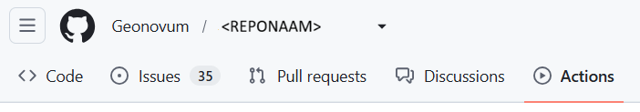
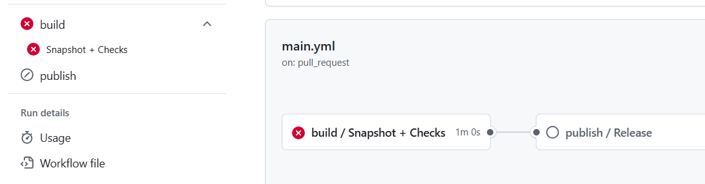
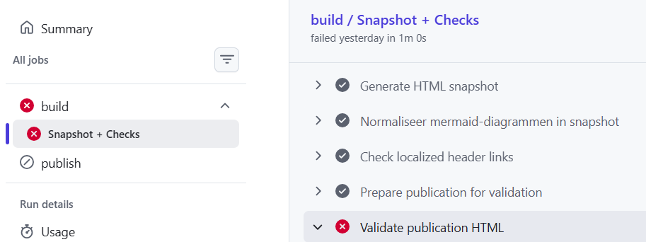
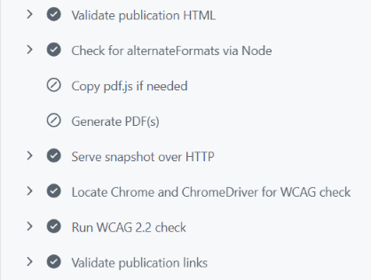
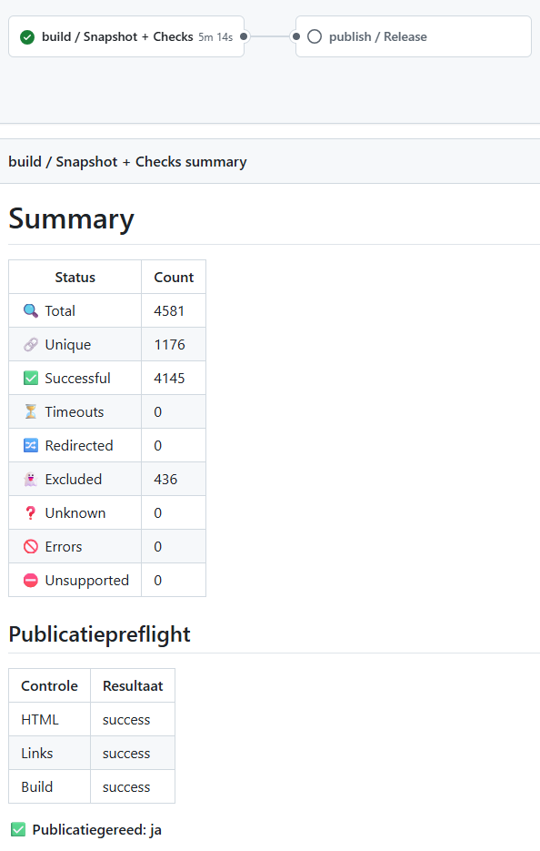
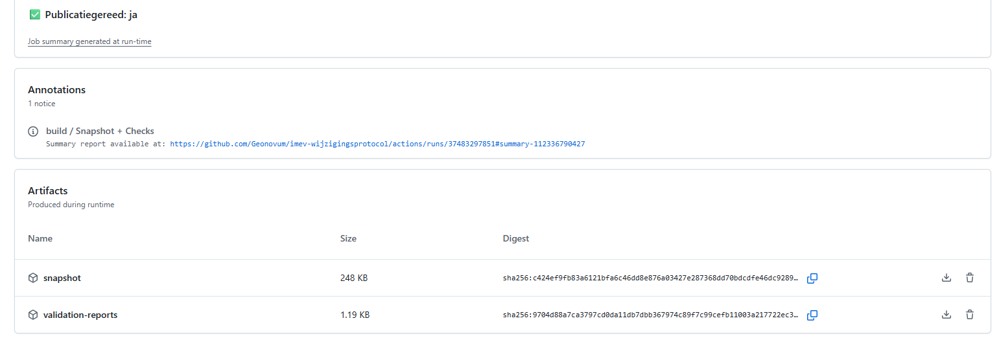
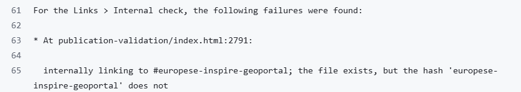
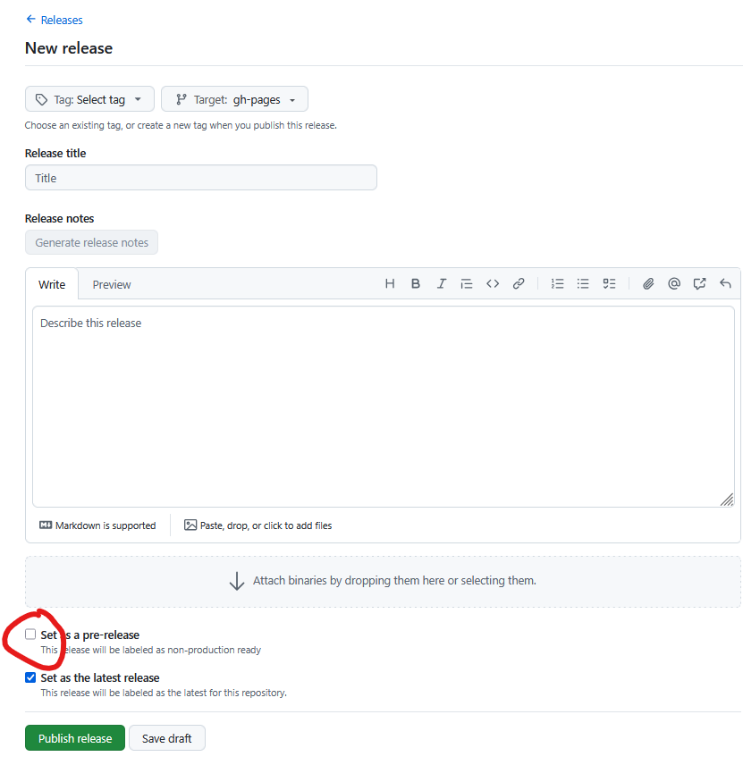

# Publiceren van een ReSpec document

Het publiceren van een ReSpec document bestaat uit het omzetten van de werkversie
van dat document op GitHub naar een vaststellingsversie, consultatieversie of definitieve versie en het neerzetten van die versie op <https://docs.geostandaarden.nl>. Dit gaat in een aantal stappen:

1. Zet de werkversie klaar voor publicatie door in config.js de velden `pubDomain`, `shortName`, `publishDate`, `specStatus` en evt. `specType`, `previousMaturity` en `previousPublishDate` in te vullen. 
2. Zorg ook dat de automatische controle (bij push naar github) geen fouten meer geeft. 
3. Door in het GitHub repository op 'Draft a new Release' te drukken wordt het publicatieproces automatisch in werking gezet wat resulteert in publicatie op <https://docs.geostandaarden.nl>, of als je het vinkje 'set as a pre-release` zet op <https://test.docs.geostandaarden.nl>. Dit zorgt voor een pull request op <https://github.com/Geonovum/docs.geostandaarden.nl>. Een pre-release wordt automatisch goedgekeurd. Een officiële release moet goedgekeurd worden door een reviewer.
4.  Als de release gelukt is begint het proces weer van voor af aan en zet je in de werkversie de specStatus weer op `wv`. Ook laat je `previousMaturity`en `previousPublishDate` verwijzen naar de zojuist gepubliceerde versie.

## Stap 1: zet de werkversie klaar voor publicatie

Zorg dat je werkversie op GitHub helemaal klaarstaat voor publicatie door in config.js `pubDomain`, `shortName`, `publishDate`, `specStatus` en evt. `specType`, `previousMaturity` en `previousPublishDate` in te vullen. Zorg ook dat de automatische controle (bij push naar github) geen fouten meer geeft.

De status van een document staat in het veld `specStatus`. Documenten met de status 'wv' (werkversie) staat altijd op github. Te publiceren documenten hebben één van de volgende statussen:

- 'cv': voor een consultatieversie.
- 'vv': voor een vaststellingsversie.
- 'def': voor een definitiever versie.
- 'ld': voor een levend document.

De velden `previousmaturity` en `previousPublishDate` moeten ingevuld zijn. Deze velden zorgen ervoor dat het nieuw gepubliceerde document verwijst naar de vorige gepubliceerde versie waardoor door steeds op 'vorige' te klikken alle versies van een document te vinden blijven.

**Noot:** Automatisch publiceren werkt alleen wanneer er, conform de [werkwijze](./index.md#respec-via-markdown), één ReSpec document in een repository staat. Als er meerdere Respec documenten in een repository staan kun je [handmatig publiceren](#handmatig-publiceren-van-respec-document).

## Stap 2: fouten bij push oplossen

Zie ook: [README bij Geonovum ReSpec template](https://github.com/Geonovum/NL-ReSpec-template/blob/main/README.md).

### Uitgangspunten
- de folderstructuur van de repository waarin het ReSpec document staat, moet conform de [Geonovum ReSpec template](https://github.com/Geonovum/NL-ReSpec-template) zijn
- dat wil zeggen, 
    - `index.html` in de root folder, 
    - `config.js` in `/js` folder, 
    - afbeeldingen (of anders?) in `/media` en/of `/data` folder (**+ subdirectories** zoals `Images`);
- de github repository mag maar één ReSpec document bevatten.

### Controles
- **HTML** proof/validation, algemene HTML controle:
    - Favicon, 
    - Images, 
    - Links,
    - OpenGraph, 
    - Scripts        
- **WCAG** check, controle op webtoegankelijkheid regels (-> WCAG rapport).
- **publication links**, `publicatiepreflight`, is het document gereed voor publicatie?  
   
- Resultaten controle zijn te vinden onder 'Actions'.  
  <!--  -->
  
- Kies hier de commit die je gedaan hebt en je ziet na klikken op 'build > Snapshot + Checks'  
  <!--    -->
   Snapshot + Checks" style="max-width:600px; height:auto;">
- 'Snapshot + Checks' stappen  
  <!--  -->
    

    - 'Validate publication HTML', 'Run WCAG x.x check' en 'Validate publication links'  
        
    - publicatiegereed ja/nee?  
      <!--  -->
        
    - evt. artefacts/artifacts bekijken  
      

### Typische fouten
- referentiefout id (#`<id>` waarvan er geen element is met id="`<id>`").  
- broken link (?), bijv `internally linking to docs.geostandaarden.nl/xxx/yyy/, which does not exist`. Hier ontbreekt het protocol `https://`.
- `error: Duplicate ID “xxx”.`, dubbele id's, bijvoorbeeld meerdere keer id="col1" bij tabellen gegenereerd bij word2respec.
- ongeldige html-tags, bijvpoorbeeld `<h7>` of `<alias>`. Dit is typisch voor een oudere imvertor-versie. Oplossing is om opnieuw output met imvertor te creëren.

## Stap 3: Maak een (Test)Release

Via het knopje 'Draft a new Release' start je het publicatieproces. Er verschijnt het volgende scherm:

Vul de velden als volgt in:

- Tag: kies hier een tag voor de release. Conventie: `[specStatus]-[spectype]-[shortName]-[publishDate]/`
- Release title: mens leesbare naam.
- Set as a pre-release: gaat het om een testversie of een officiële publicatie?

Door de knop 'Publish release' in te drukken wordt het publicatieproces gestart. Dit kan enige tijd duren. Afhankelijk van of het een test release is of gebeurt het volgende:

- Bij een test-release wordt de publicatie automatisch goedgekeurd en gepubliceerd op <https://test.docs.geostandandaarden.nl>. 
- Bij een officële release resulteert de publicatie in een pull request op <https://github.com/Geonovum/docs.geostandaarden.nl>. Eén van de reviewers checkt de publicatie en na goedkeuring verschijnt deze automatisch.

Voor deze automatische publicatie gelden de volgende eisen, naast uitgangspunten en controles zoals beschreven bij **stap 2**: GEEN?

Meer documentatie staat in de readme van [NL-ReSpec-template](https://github.com/Geonovum/NL-ReSpec-template?tab=readme-ov-file#automatische-checks-en-build).

### Stap 4: Zet de 'specStatus' weer op werkversie

Als de publicatie gelukt is begin het werk aan de volgende versie. Deze
start weer als werkversie. Zet in je beheerdocument de specStatus weer op 'wv'.

### Configureren van de automatische workflow

Bij het maken van een nieuw ReSpec document via de [template](https://github.com/Geonovum/NL-ReSpec-template) wordt de workflow automatisch geïnstalleerd. In github repositories die al een ReSpec document hadden voordat de nieuwe publicatieworkflow werd geïntroduceerd, is de workflow meestal ook al geinstalleerd. Alle actieve repositories waar een 'js/config.js' in gevonden is, hebben de nieuwe workflow gekregen.

Je kan controleren of de workflow is geïnstalleerd door bovenin de README.md in je repository te kijken. Hier moet in staan: 

> Deze repository is automatisch bijgewerkt naar de nieuwste workflow. Voor vragen, neem contact op met Linda van den Brink of Wilko Quak.
> Als je een nieuwe publicatie wilt starten, lees dan eerst de instructies in de README van de NL-ReSpec-template: https://github.com/Geonovum/NL-ReSpec-template.

Als de workflow niet automatisch is geïnstalleerd, kun je dit zelf doen. Dit is een eenmalige stap. Mocht dit niet lukken, dan kan Linda, Wilko, Inge of Matthijs erbij helpen:

**Zorg dat Git is geïnstalleerd en beschikbaar is in je terminal**

1. Open de **Opdrachtprompt**:
    - ➜ Druk op de **Windows-knop**, typ `cmd`, druk op **Enter**
1. Typ vervolgens in de cmd terminal:
    - `git --version`
    - Zie je een versie zoals `git version 2.x.x`, dan is alles goed.
1. Krijg je een foutmelding zoals `'git' is not recognized as an internal or external command`, dan moet je Git nog installeren via: https://git-scm.com/downloads/win
 
**Vervolg, na installatie van git**

1. **Navigeer naar de repository in Verkenner**
1. Open de map waarin de repository staat
    - **Shift** + **rechter muisklik** in een lege ruimte in de map
    - Kies **"PowerShell-venster hier openen"** of **"Open in terminal"**
1. **Download en voer het script uit.**  Kopieer en plak de volgende regels in PowerShell, voer ze om beuren uit:
    1. `curl -o replace_workflow-local.ps1 https://raw.githubusercontent.com/Geonovum/NL-ReSpec-template/main/replace_workflow-local.ps1`
    1. `Set-ExecutionPolicy -Scope Process -ExecutionPolicy Bypass`
    1. `.\replace_workflow-local.ps1`
1. Als er geen errors verschijnen is dit gelukt. Je kunt dit checken door README.md te openen: als het goed is staat hier nu bovenin een tekst die begint met "Deze repository is automatisch bijgewerkt..."

**Tenslotte**

1. Verwijder het bestand "replace_workflow-local.ps1"

## 'Handmatig' publiceren van respec document.

Het is ook mogelijk om documenten handmatig te publiceren op docs.geostandaarden.nl:

- docs.geostandaarden.nl is een mirror van: <https://github.com/Geonovum/docs.geostandaarden.nl/>
- Bij handmatige publicatie wijzig je rechtstreeks de repository. Maak in dit geval een pull request voor het repository met de publish-versie van je respec-document' (~ snapshot.html als index.html +media) en laat het goedkeuren zoals hierboven beschreven.
- In noodgevallen kunnen beheerders ook zonder pull request wijzigingen doorvoeren. In dat geval moet <docs.geostandaarden.nl> handmatig gesynchroniseerd worden. Dat kan via <https://github.com/Geonovum/docs.geostandaarden.nl/actions/workflows/deploy.yml> . Hier zie je een knopje: ‘Run workflow’.
