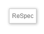

# ReSpec

We maken standaarden met ReSpec. De inhoud van ReSpec documenten zit in Markdown bestanden die je met een text editor kunt bewerken. De bestanden worden in een GitHub repository beheerd.

ReSpec is een tool van W3C voor het schrijven van specifications.
ReSpec zorgt voor een uniforme styling in het document, onderhoudt
referenties en verwijzingen naar andere documentatie, verzorgt de inhoudsopgave,
zorgt voor links naar vorige en meest recente versies, en heeft een integratie
met Github issues.

Geonovum gebruikt een fork van ReSpec die door Logius beheerd wordt. Dit
document bevat een globale instructie over hoe snel aan de start te gaan. Meer
documentatie is op andere plaatsen te vinden:

- Er is een gedetailleerde
  [gebruikershandleiding](https://github.com/w3c/respec/wiki/ReSpec-Editor's-Guide)
  beschikbaar.
- Er is ook een
  [ontwikkelaarshandleiding](https://github.com/w3c/respec/wiki/Developers-Guide)
  te vinden.
- De Geonovum [wiki over ReSpec](https://github.com/Geonovum/respec/wiki) is
  een fork van de w3c ReSpec met aanpassingen voor Geonovum. Deze is
  achterhaald omdat we nu van de Logius Respec gebruik maken. (TODO aanpassen)

## Workflow voor het beheer van een ReSpec document

Het volgende diagram beschrijft de workflow voor het maken van een
ReSpec publicatie:


## ReSpec via Markdown

ReSpec documenten worden beheerd in een [GitHub](/GitHub) repository.

1. Gebruik de [Geonovum ReSpec template](https://github.com/Geonovum/NL-ReSpec-template)
als startpunt en druk op 'Use this template'.
2. Vervang alle voorkomens van 'TODO' met inhoud.

**Regel:** Een github repository mag maar één ReSpec document bevatten.

**Regel:** Nieuwe ReSpec documenten in Markdown volgen de  [Geonovum ReSpec template](https://github.com/Geonovum/NL-ReSpec-template)


## De URL van een publicatie op docs.geonovum.nl

ReSpec documenten worden gepubliceerd op
[docs.geostandaarden.nl](https://docs.geostandaarden.nl). Iedere gepubliceerde
versie van een document heeft een eigen URL. Voor de laatst gepubliceerde versie
is een aparte URL.

De URL van iedere publicatie wordt als volgt bepaald:

```text
https://docs.geostandaarden.nl/[pubdomain]/[specStatus]-[spectype]-[shortName]-[publishDate]/
```

De laatst gepubliceerde versie is OOK te vinden op:

```text
https://docs.geostandaarden.nl/[pubdomain]/[shortName]/
```

De namen van de variabelen staan verderop uitgelegd.

## De bestanden van een ReSpec repository

### Het bestand 'index.html'

Het bestand index.html zorgt ervoor dat het ReSpec document automatisch wordt
geladen in de browser. Bij het laden wordt ook automatisch de
geonovum-ReSpec-code geladen en uitgevoerd. Deze code zorgt ervoor dat het
document zijn standaard layout krijgt.

Het bestand 'index.html' heeft een vaste indeling.

In de HTML-header wordt de js-ReSpec bibliotheek geladen. Het enige dat in de
header mag worden aangepast is de title (tussen \<title\> en \</title\>.

In de HTML-Body geldt _vrijheid in gebondenheid_ De `<div>` en/of `<section>`
regels mogen worden gekopieerd en toegevoegd. Wel belangrijk om de structuur
over te nemen, dus als volgt:

```html
<div id='H00' data-format='Markdown' data-include="ToCoVo.md"></div>
<section id='H01' data-format='Markdown' data-include="H1-Inleiding.md"\>\<h2\>Inleiding\</h2\>\</section\>
```

Een `<div>` is een sectie plus bijbehorend document, dat niet in de
inhoudsopgave terechtkomt. Deze gebruik je bijvoorbeeld voor een Toelichting,
een Colofon of een Voorwoord.

Een `<section>` komt wél in de inhoudsopgave terecht. Deze heeft daarom behalve
de data-include van het document, ook (verplicht!) een `<h2>` tag. De tekst
tussen `<h2>` en `</h2>` komt in de inhoudsopgave te staan.

### Het bestand 'js/config.js'

In config.js wordt een stuurvariabele voor ReSpec gevuld. De waarden in deze
variabele worden door ReSpec gebruikt om de layout te bepalen, en bevatten een
aantal document-eigenschappen.

### SpecStatus

**Bron:** <https://github.com/Geonovum/tools.geostandaarden.nl/blob/main/tools.geostandaarden.nl/respec/config/geonovum-config.js>

De SpecStatus in de configuratie geeft de keuze uit 4 waarden, deze waarden zijn
vastgesteld, en mogen niet zomaar uitgebreid of aangepast worden. Elke status
hoort bij een formele fase van een ReSpec document. Zie ook de Geonovum ReSpec
[wiki](https://github.com/Geonovum/respec/wiki).

- **wv**, Werkversie: Dit is de versie van het document waaraan wordt
  gewerkt. Deze versie is continu 'under-construction'.
- **cv**, Consultatieversie: Dit is een 'snapshot' van de versie die 'in
    consultatie' wordt gezet. Aan deze versie wordt niks meer gedaan totdat de
    consultatie is afgelopen. Daarna worden alle op en aanmerkingen uit de
    consultatieronde verwerkt.
- **vv**, Vaststellingsversie: Dit is een 'snapshot' van de versie na het
    verwerken van de op en aanmerkingen uit de consultatieronde is ontstaan.
    Deze versie wordt aangeboden aan de programma-raad van Geonovum, om te
    worden 'vastgesteld'.
- **def**, Definitieve versie: Dit is de definitieve versie van het document,
    zoals vastgesteld door de programma-raad. Van deze versie wordt opnieuw een
    'snapshot' gemaakt in ReSpec. Het resultaat van die snapshot wordt op
    <http://docs.geonovum.nl> neergezet.
- **ld**, Levend document: Geschikt voor handreikingen en dergelijke die
  regelmatig gewijzigd worden en waarvoor niet een consultatie- en
  goedkeuringsproces gevolgd hoeft te worden
- **basis**, document zonder officiële status.

### SpecType

**Bron:** <https://www.geonovum.nl/uploads/documents/Geonovum%20GENERIEK%20Beheerplan%20geo-standaarden%20v1.1.pdf>

Het SpecType in de configuratie is een vaste lijst met waarden, deze waarden
zijn vastgesteld, en mogen niet zonder overleg met de Technische ReSpec
beheerders uitgebreid of aangepast worden.

- **NO** Norm: Een norm is bij een officieel standaardisatie instituut
    ondergebracht en bevat bindende afspraken. Naast het gebruik van normen is
    NEN 3610 de enige norm waar Geonovum een inhoudelijke verantwoordelijkheid
    heeft. Het formele beheer en beslissingen worden genomen in de NEN
    normcommissie 351 240 waar Geonovum de voorzitter van is.

- **ST** Standaard: Een document met (bindende) afspraken.

- **IM** Informatiemodel: Een standaard waarbij door de term informatiemodel
    te hanteren wordt aangegeven dat het een abstractie (het model) vormt van de
    werkelijkheid zoals beschreven binnen een bepaalde sector/domein.
    Informatiemodellen zijn een semantische invulling van normen voor sectoren
    zoals ruimtelijke ordening, kabels en leidingen, water, etc..

- **PR** Praktijkrichtlijn: Praktijkrichtlijnen zijn producten die informatie
    geven, vaak met een technisch karakter, die nodig is voor het toepassen van
    standaarden. Een praktijkrichtlijn hoort altijd bij een standaard/norm.

- **HR** Handreiking: Op zichzelf staande documentatie dat als doel heeft een
    hulpmiddel te zijn, niet verplichtend maar ondersteunend.

- **WA** Werkafspraak: Legt uit hoe wetgeving moet worden toegepast bij
    onduidelijkheden, discrepanties of fouten in de standaarden.

- **BD** Beheerdocumentatie: Documentatie met betrekking tot het beheerproces
    van de standaard. Deze documentatie betreft niet een standaard of onderdeel
    daarvan, zoals een handreiking of werkafspraak.

- **AL** Algemeen: Op zichzelf staande algemene documentatie over standaarden.
    De documentatie betreft niet een specifieke standaard of onderdeel daarvan,
    het is ook geen beheerdocumentatie van een specifieke standaard.

### pubDomain

pubDomain bepaalt bij publicatie een deel van de URL waarop het document wordt
gepubliceerd. Het zorgt voor een groepering van de documenten op
docs.geostandaarden.nl Omdat je de URL van gepubliceerde documenten niet wilt
veranderen is moet je hier goed over nadenken en alleen in overleg nieuwe
toevoegen.

De actuele lijst van pubDomains staat in de tabel hieronder. De herkomst van
deze lijst is als volgt:

1. Lijst op github :
   [respec-utils](https://github.com/Geonovum/respec-utils/blob/master/src/autodeploy/config/pubDomainList.json).
2. docs.geostandaarden.nl.
3. register.geostandaarden.nl.

Naamgevinsregels voor pubDomain:

- Lowercase
- Geen spaties

| Pubdomain      | Omschrijving                                             | Herkomst                   | status                    | GitHub Team                                                   | Beslissing                              |
| -------------- | -------------------------------------------------------- | -------------------------- | ------------------------- | ------------------------------------------------------------- | --------------------------------------- |
| 3dbv           | 3D basisvoorziening                                      | docs.geostandaarden.nl     | inactief (gemigreerd)     |                                                               | mag niet meer gebruikt worden           |
| api            | Kennisplatform APIs                                      | respec utils               |                           | [API team](https://github.com/orgs/Geonovum/teams/api-team)   | OK                                      |
| basisgeometrie | Informatiemodel Basisgeometrie                           | register.geostandaarden.nl | zit op docs bij nen3610   |                                                               | niet gebruiken eigenlijk xsd redirecten |
| bgt            | Basisregistratie grootschalige topografie                | docs.geostandaarden.nl     |                           | [BGT team](https://github.com/orgs/Geonovum/teams/bgt-team)   | Arnoud vragen                           |
| brt            | Informatiemodellen Basisregistratie Topografie           | register.geostandaarden.nl |                           | [BRT team](https://github.com/orgs/Geonovum/teams/brt-team)   | OK                                      |
| crs            | Coördinaatreferentiesystemen                             | docs.geostandaarden.nl     |                           | [CRS team](https://github.com/orgs/Geonovum/teams/crs-team)   | OK                                      |
| cvgg           | Informatiemodel Geluid                                   | docs.geostandaarden.nl     | duplicaat van img         |                                                               | OK                                      |
| disgeo         | DisGeo                                                   | respec utils               |                           |                                                               | OK                                      |
| dsgo           | Digitaal Stelsel Gebouwde Omgeving                       | docs.geostandaarden.nl     |                           |                                                               | OK (rare uri)                           |
| dso            | Digitaal Stelsel Omgevingswet                            | respec utils               | duplicaten: tpod imow ow  | [DSO team](https://github.com/orgs/Geonovum/teams/dso-team)   | OK                                      |
| eu             |                                                          | docs.geostandaarden.nl     |                           | [EU team](https://github.com/orgs/Geonovum/teams/eu-team)     | OK (rare uri en werkversie weg)         |
| g4w            |                                                          | docs.geostandaarden.nl     |                           |                                                               | groeperen?                              |
| gbd            |                                                          | docs.geostandaarden.nl     |                           |                                                               | groeperen?                              |
| geobag         |                                                          | docs.geostandaarden.nl     |                           |                                                               | OK                                      |
| gsw            |                                                          | docs.geostandaarden.nl     |                           |                                                               | groeperen?                              |
| imaer          | Informatiemodel AERIUS                                   | register.geostandaarden.nl |                           |                                                               | OK                                      |
| imev           | Informatiemodel Externe Veiligheid                       | docs.geostandaarden.nl     |                           | [IMEV team](https://github.com/orgs/Geonovum/teams/api-team)  | OK                                      |
| img            | Informatiemodel Geluid                                   | respec utils               | duplicaat: cvgg           | [IMG team](https://github.com/orgs/Geonovum/teams/img-team)   | redirecten naar cvgg                    |
| imgeo          | Informatiemodel Grootschalige Geografie                  | docs.geostandaarden.nl     |                           |                                                               | Arnoud vragen                           |
| imka           | Informatiemodel Klimaatadaptatie                         | docs.geostandaarden.nl     |                           |                                                               | OK                                      |
| imkad          | Informatiemodel Kadaster                                 | register.geostandaarden.nl |                           | [IMKA team](https://github.com/orgs/Geonovum/teams/imka-team) | OK                                      |
| imkl           | Informatiemodel Kabels en Leidingen                      | register.geostandaarden.nl | duplicaat: kl             | [IMKL team](https://github.com/orgs/Geonovum/teams/imkl-team) | Zou kl moeten worden                    |
| imle           |                                                          | docs.geostandaarden.nl     |                           |                                                               | OK (niet netjes gepubliceerd)           |
| imro           | Informatiemodel Ruimtelijke Ordening                     | register.geostandaarden.nl | duplicaat: ro             |                                                               | liefst naar RO                          |
| imow           | Informatiemodel Omgevingswet                             | register.geostandaarden.nl | duplicaten: tpod ow dso   |                                                               | liefst weg                              |
| kl             | IMKL                                                     | respec utils               | duplicaat: imkl           |                                                               | OK                                      |
| md             | Metadata                                                 | respec utils               | duplicaat: metadata       |                                                               | OK                                      |
| mim            | Metamodel Informatie Modellering (MIM                    | respec utils               |                           |                                                               | OK                                      |
| metadata       | Nederlandse metadata profielen voor datasets en services | register.geostandaarden.nl | duplicaat: md             |                                                               | verplaatsen naar md??                   |
| nen3610        | NEN3610-Linkeddata                                       | respec utils               |                           |                                                               | OK                                      |
| ngii           |                                                          | docs.geostandaarden.nl     |                           |                                                               | OK                                      |
| oov            |                                                          | docs.geostandaarden.nl     |                           |                                                               | OK                                      |
| ow             | Standaarden omgevingswet                                 | respec utils               | duplicaten: tpod imow dso |                                                               | OK                                      |
| ro             | RO Standaarden                                           | respec utils               | duplicaat: imro           |                                                               | OK                                      |
| rwgs           | Raamwerk van Geo-standaarden                             | respec utils               |                           |                                                               | groeperen?                              |
| serv           | Services                                                 | respec utils               |                           |                                                               | groeperen?                              |
| tpod           | Toepassingsprofiel omgevingsdocumenten                   | respec utils               | duplicaten: ow imow dso   |                                                               | OK                                      |
| vg             | Informatiemodel Vastgoedgebruik                          | respec utils               |                           |                                                               | OK                                      |
| visu           | Visualisatie                                             | respec utils               |                           |                                                               | groeperen?                              |
| vtm            |                                                          | docs.geostandaarden.nl     | is eigenlijk metadata     |                                                               | verhuizen naar MD                       |
| wp             | Whitepaper Geostandaarden                                | respec utils               | ook een raar pubdomain    |                                                               | verhuizen naar ngii                     |

## Bibliografie

ReSpec maakt automatisch een literatuurlijst van alle documenten waarnaar
je verwijst. Een normatieve verwijzing naar een document ziet er als volgt uit

```markdown
we gebruiken [[SemVer]] voor het nummeren van versies.
```

De referentie in dubbele blokhaken wordt op drie niveaus gezocht:

- Een globale lijst is te vinden op: [SpecRef](https://www.specref.org/).
- Een Geonovum brede lijst is te vinden op: [specref.geostandaarden.nl](https://specref.geostandaarden.nl/)
- In de lokale `config.js` kan je lokale referenties toevoegen

Bij verwijzingen kan je kiezen of ze normatief zijn of niet. In
de referenties onderaan worden twee lijsten getoond. 
Of een referentie normatief is of niet hangt ervanaf of het hoofdstuk
normatief is of niet. Per referentie kan het ook instellen door een 
uitroepteken of vraagteken voor de verwijzing zetten te zetten `[[!ID]]` of `[[?ID]]`.

## Content: markdown bestanden

De 'echte' content wordt gemaakt in het formaat 'Markdown'. Er is een aantal
editors beschikbaar die dat formaat ondersteunen. Maak van elk hoofdstuk
een aparte Markdown file.

## Afbeeldingen

Afbeeldingen worden als '.png' of '.svg' bestand neergezet in de map 'media'.

## ReSpec Frontend

### De knop 'ReSpec'

De knop 'ReSpec' rechtsboven in de frontend van ReSpec, bevat een aantal
functies. Als je klikt op de knop, verschijnt het vervolgscherm met een viertal
functies.

Elk van de functies wordt hieronder uitgelegd.



### Bewaar snapshot


### Doorzoek SpecRef

 

De gevonden zoekresultaten kunnen worden overgenomen in het ReSpec document.

### Lijst van definities

Zie: [definitielijst maken](ReSpec-definitielijst-maken.md)

## HTML ingebed in ReSpec

Omdat wij ervoor hebben gekozen om documenten te schrijven in Markdown,
gebruiken wij niet alle ReSpec functionaliteit. In dit hoofdstuk worden de
speciale ReSpec functies beschreven die als HTML code in het Markdown document
kunnen wordnen opgenomen, of die in de door respec gegenereerde HTML file kunnen
worden neergezet. Het gebruik van deze functionaliteit vereist dus wel HTML
kennis.

## HTML voor Afbeeldingen

Een lijst van afbeeldingen kan door ReSpec automatisch worden gegenereerd, maar
dan moet er wel aan een aantal ReSpec specifieke voorwaarden worden voldaan:

In Index.html komt ergens te staan:

```html
<figure id="flowchart">
   
   <figcaption>The water flows from bucket A to bucket B.</figcaption>
</figure>
```

In de documenten worden de afbeeldingen op de volgende manier neergezet:

```html
<figure id="flowchart">
   
   <figcaption>The water flows from bucket A to bucket B.</figcaption>
</figure>
```

NB: `<figure>` inclusief uniek ID en een ge-embedde `<figcaption>` zijn
verplicht!

Eventuele referenties naar plaatjes doe je op e volgende manier:

```html
<p>The flowchart shown in <a href="#flowchart"></a> is quite impressive.</p>
</section>
```

## Referentie naar GitHub issues

ReSpec ondersteunt ook een koppeling naar issues die zijn gemeld op GitHub. Jek
kan referenties opnemen naar individuele issues. Ook is het mogelijk om een
lijst met alle issues op te nemen in je document.

Om GitHub issues op te nemen moet je in 'config.js' een referentie opnemen naar
de GitHub repository.

```html
issueBase: "https://github.com/Geonovum/MIM-Werkomgeving/issues/"
```

Een referentie naar een issue neem je als volgt op:

```html
<div class="issue" data-number="363"></div>
```

Waarbij data-number het issuenummer is.

Een lijst met issues kan je toevoegen met de volgende HTML code:

```html
<section class="appendix" id="issue-summary">
  <!-- Issues will magically be listed here! -->
</section>

```

## Publiceren in ReSpec

In dit hoofdstuk staan checklists die je kan gebruiken als je een nieuwe
versie van een ReSpec document wilt publiceren op docs.geostandaarden.nl

## Controles voor publicatie

Controleer de volgende onderwerpen voor iedere publicatie:

- Controleer op **WCAG** (web toegankelijkheids-) regels. Bij het pushen van een ReSpec document naar
    GitHub wordt automatisch een WCAG rapport geschreven. Dit is te vinden onder
    'Actions'. Kies hier de commit die je gedaan hebt en je ziet daar
    'build/WCAG Accessibility Check'). Deze controle checkt ook de HTML.
- Controleer op **Broken links**. Bij het pushen van een ReSpec document naar
    GitHub wordt automatisch op broken links gechecked. Dit is te vinden onder
    'Actions'. Kies hier de commit die je gedaan hebt en je ziet daar
    'Build/Link validation').

Los eventuele fouten op voordat je verder gaat met publiceren. 

## Publiceren


[Klik hier](ReSpec-publiceren.md) voor een beschrijving van de automatische publicatieworkflow.

Voorwaarden voor de werking van de publicatieworkflow: 

- de folderstructuur van de repository waarin het ReSpec document staat, moet conform de [Geonovum ReSpec template](https://github.com/Geonovum/NL-ReSpec-template) zijn
    - dat wil zeggen, `index.html` in de root folder, `config.js` in `/js` folder, afbeeldingen in `/media` en/of `/data/Images` folder;
- de github repository mag maar één ReSpec document bevatten.


## Publiceren van een Consultatie versie (CV)

1. In 'js/config.js':
    - `specStatus`:`"CV"`
    - `publishDate`: moet ingevuld zijn met de datum van publicatie van de. `"jjjj-mm-dd"`,
    - `Shortname`: moet ingevuld zijn met korte naam voor het document. Dit
      wordt onderdeel van de URL. Moet uniek zijn binnen pubdomain (afgezien van
      versies).
        - Als er al eerder een versie gepubliceerd is (stabiele versie, dus
          afgezien van de werkversie in github), kan Respec bovenin een document
          de navigatie naar vorige versie goed genereren. Daarvoor moet je ook
          invullen:
        - `Previousmaturity`: wat de status toen was.
        - `previousPublishDate`: wat de status toen was.
1. Commit je wijzigingen en push de commit. Dit triggert de [publicatieworkflow](ReSpec-publiceren.md).

### Consultatieversie maken en automatisch publiceren

1. Maak een release tag conform de naamgevingsconventie:
   `\{specStatus\}-\{specType\}-\{shortName\}-\{publishDate\}`
1. Het script kopieert nu automatisch (NB: dit moet wel eenmalig geconfigureerd
   zijn als [workflow](ReSpec-publiceren.md) in de github repository!) het `snapshot.html` en de
   bijbehorende afbeeldingen naar de [publicatierepository](https://github.com/Geonovum/docs.geostandaarden.nl). 
1. Eén van de reviewers Frank Terpstra, Linda van den Brink of Wilko Quak checkt de publicatie. Als alles goed is bevonden  wordt het document vervolgens automatisch gepubliceerd op 
   [docs.geostandaarden.nl](http://docs.geostandaarden.nl).
1. Na succesvolle publicatie:
    - zet de `specStatus` in `config.js` terug op `"WV"`
    - Vul `previousMaturity` in met `"CV"`
    - Vul `previousPublishDate` in met de datum van de zojuist gepubliceerde
      consultatieversie

## Vaststellingsversie (VV) maken

1. Edit en controleer config.js - configureer alles goed voor een
   vaststellingsversie
    - specStatus: "VV"
    - publishDate: moet ingevuld zijn met de datum van publicatie van de
      consultatieversie. "jjjj-mm-dd",
    - Shortname: moet ingevuld zijn met korte naam voor het document. Dit wordt
      onderdeel van de URL. Moet uniek zijn binnen pubdomain (afgezien van
      versies).
        - Als er al eerder een versie gepubliceerd is (stabiele versie, dus
          afgezien van de werkversie in github), kan Respec bovenin een document
          de navigatie naar vorige versie goed genereren. Daarvoor moet je ook
          invullen:
        - Previousmaturity: wat de status toen was.
        - Previousmaturity: wat de status toen was.
2. Commit je wijzigingen en push de commit. 
5. Maak een release tag conform de naamgevingsconventie:
   \{specStatus\}-\{specType\}-\{shortName\}-\{publishDate\}
6. Het script kopieert nu automatisch (NB: dit moet wel eenmalig geconfigureerd
   zijn als [workflow](ReSpec-publiceren.md) in de github repository!) het`snapshot.html` en de
   bijbehorende afbeeldingen naar de [publicatierepository](https://github.com/Geonovum/docs.geostandaarden.nl). 
1. Eén van de reviewers Frank Terpstra, Linda van den Brink of Wilko Quak checkt de publicatie. Als alles goed is bevonden  wordt het document vervolgens automatisch gepubliceerd op 
   [docs.geostandaarden.nl](http://docs.geostandaarden.nl).
7. Na succesvolle publicatie:
    - zet de specStatus in config.js terug op WV
    - Vul previousMaturity in met CV
    - Vul previousPublishDate in met de datum van de zojuist gepubliceerde
      consultatieversie

## Definitieve versie (DEF) maken

1. Zet in config.js alles goed voor een definitieve versie
    - specStatus: "DEF",
    - publishDate: de publicatiedatum van de definitieve versie. "jjjj-mm-dd",
    - Shortname: korte naam voor het document. Dit wordt
      onderdeel van de URL. Moet uniek zijn binnen pubdomain (afgezien van
      versies).
    - Als er al eerder een versie gepubliceerd is (stabiele versie, dus afgezien
      van de werkversie in github), kan Respec bovenin een document de navigatie
      naar vorige versie goed genereren. Daarvoor moet je ook invullen:
        - Previousmaturity: wat de status toen was.
        - previousPublishDate: vorige publicatiedatum (jjjj-mm-dd)
2. Commit je wijzigingen en push de commit. Dit triggert de publicatieworkflow.
5. Maak een release tag conform de naamgevingsconventie:
   {specStatus}-{specType}-{shortName}-{publishDate}
6. Het script kopieert nu automatisch (NB: dit moet wel eenmalig geconfigureerd
   zijn als [workflow](ReSpec-publiceren.md) in de github repository!) het`snapshot.html` en de
   bijbehorende afbeeldingen naar de [publicatierepository](https://github.com/Geonovum/docs.geostandaarden.nl). 
1. Eén van de reviewers Frank Terpstra, Linda van den Brink of Wilko Quak checkt de publicatie. Als alles goed is bevonden  wordt het document vervolgens automatisch gepubliceerd op 
   [docs.geostandaarden.nl](http://docs.geostandaarden.nl).
7. Na succesvolle publicatie:
    - zet de specStatus in config.js terug op WV
    - Vul previousMaturity in met DEF
    - Vul previousPublishDate in met de datum van de zojuist gepubliceerde
      definitieve versie
