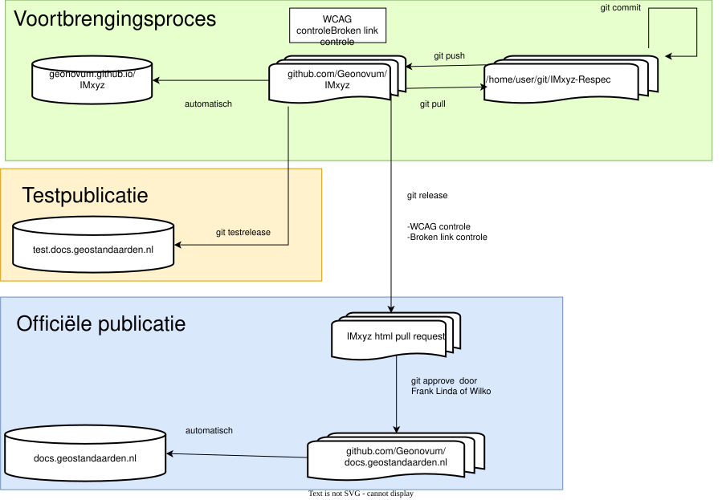

# ReSpec

We maken standaarden met ReSpec. De inhoud van ReSpec documenten zit in Markdown bestanden die je met een text editor kunt bewerken. De bestanden worden in een GitHub repository beheerd. ReSpec

- zorgt voor een uniforme styling,
- onderhoudt referenties en verwijzingen naar andere documentatie,
- verzorgt de inhoudsopgave,
- zorgt voor links naar vorige en meest recente versies,
- heeft een integratie met Github issues.

Het volgende diagram beschrijft het proces voor het maken van een
ReSpec publicatie:

Het proces bestaat uit een [voortbrengingsproces](#het-voorbrengingsproces) waarin met het werkveld het
document wordt gemaakt. Als uit dit proces een publiceerbare versie ontstaat wordt deze via het [publicatieproces](./ReSpec-publiceren.md) gepubliceerd.

Geonovum gebruikt de Logius [ReSpec](https://github.com/Logius-standaarden/respec) in een GitHub omgeving voor het beheer van de documenten.

Documentatie over ReSpec is te vonden
- Er is een gedetailleerde
  [gebruikershandleiding](https://github.com/speced/respec/wiki/ReSpec-Editor's-Guide)
  beschikbaar.
- Er is ook een
  [ontwikkelaarshandleiding](https://github.com/speced/respec/wiki/Developers-Guide)
  te vinden.
- Ook de [template](https://github.com/Geonovum/NL-ReSpec-template/) is een mooi startpunt.

## Het voorbrengingsproces

- ReSpec documenten worden beheerd in een [GitHub](../GitHub/index.md) repository. Meestal zit er één ReSpec document in een repository.
- Maakt met `git clone` een lokaal kopie van repository waarin het ReSpec document zodat je het lokaal kunt bewerken. Een overzicht van alle GitHub repositories van Geonovum staat [hier](https://github.com/orgs/Geonovum/repositories).
- Het lokale kopie bestaat uit een collectie bestanden. De tekstuele inhoud zit meestal in markdown (*md) bestanden. Deze kan je nu lokaal wijzingen
- Met `git commit` en `git push` kun je de lokale wijzingen naar de centrale werkversie overzetten.

## Een ReSpec document publiceren op docs.geostandaarden.nl

Zie [ReSpec publiceren](ReSpec-publiceren.md)

## Een nieuw ReSpec document aanmaken

ReSpec documenten worden beheerd in een [GitHub](../GitHub/index.md) repository.

Gebruik de [Geonovum ReSpec template](https://github.com/Geonovum/NL-ReSpec-template) om een nieuw document te maken; druk op 'Use this template'. Dit maakt een GitHub repository met een template document. Dit kun je meteen gaan wijzigen. Pas op alle plekken waar TODO staat het document aan.

**Regel:** kies een logische naam voor het repository.

**Regel:** Een github repository mag maar één ReSpec document bevatten.

