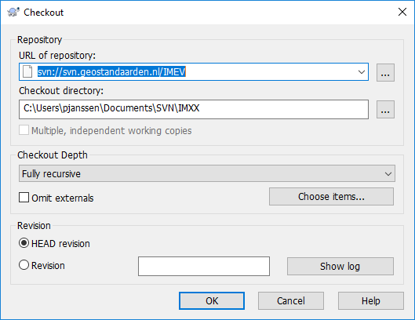
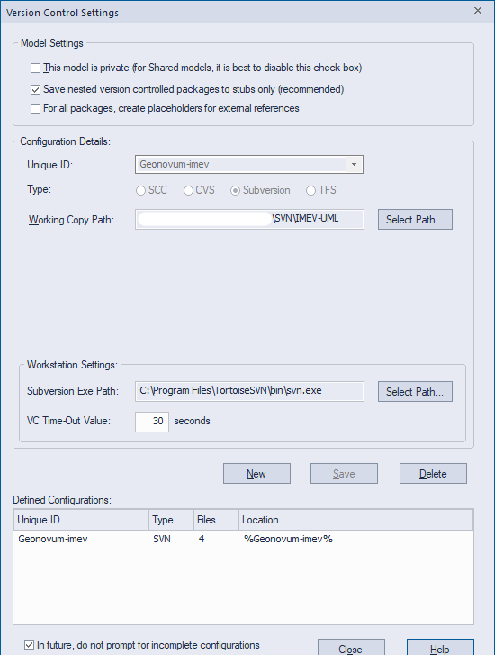
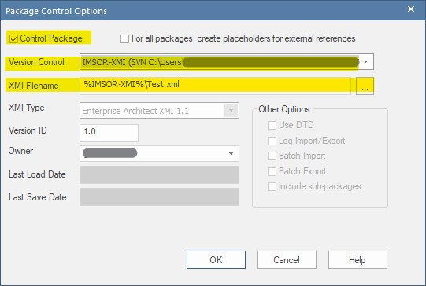

# Handleiding voor het installeren van SVN (Subversion) voor een EAP bestand.

Enterprise Architect versie: 15.2

Tortoise SVN Subversion versie: 1.14.1

## Inleiding

Informatiemodellen staan idealiter onder **Subversion**. Dit is de versiebeheertool die we bij Geonovum gebruiken. Het voordeel van versiebeheer is dat we gemeenschappelijk kunnen werken aan één model en de wijzigingen daarvan op één plek bijhouden. Deze handleiding beschrijft hoe je een informatiemodel in de versiebeheeromgeving zet.

## Inhoud

Dit document bevat de volgende onderdelen:

 - [Voorbereiding: Installeer SVN Tortoise op pc.](#voorbereiding-installeer-svn-tortoise-op-pc)
 - [Stap 1: Folder aanmaken op SVN-server](#stap-1-folder-aanmaken-op-svn-server)
 - [Stap 2: Lokale folder aanmaken](#stap-2-lokale-folder-aanmaken)
 - [Stap 3: Lokale folder koppelen aan folder op SVN-server](#stap-3-lokale-folder-koppelen-aan-folder-op-svn-server)
 - [Stap 4: Breng EAP-bestand(packages) onder SVN.](#stap-4-breng-eap-bestandpackages-onder-svn)
 - [Stap 5: Breng package onder version control](#stap-5-breng-package-onder-version-control)
 - [Stap 6: Check package in of uit](#stap-6-check-package-in-of-uit)
 - [Meer informatie](#meer-informatie)

### Voorbereiding: Installeer SVN Tortoise op pc.

Als je **SVN Tortoise** nog niet hebt, installeer deze van
<https://tortoisesvn.net/>.

> **Note**
> Installeer ook de _**Command Line Client Tools**_ mee. Dit heb je nodig bij [stap 4: Breng EAP-bestand (packages) onder SVN](#stap-4-breng-eap-bestand-packages-onder-svn). Het is een extra optie en valt niet onder de standaardinstallatie, dus je moet hier zelf alert op zijn. Het is ook mogelijk om dit achteraf te doen. Hoe je dit doet, staat beschreven in stap 4.

### Stap 1: Folder aanmaken op SVN-server

* Maak een folder op de SVN-server (`svn.geostandaarden.nl`) aan met de naam van het model.
* Een voor de hand liggende naam van de folder: `imxx` met op de plaats van de `xx` de (afkorting van de) naam van het model. Bijvoorbeeld `imka` (_informatiemodel klimaatadaptatie_)

### Stap 2: Lokale folder aanmaken

* **Maak in een lokale map** op je werk-pc een folder aan waar de SVN bestanden naar toe worden geschreven.
* `svn.geostandaarden.nl/imxx` synchroniseert met deze folder.
* Een naam voor deze folder is bijvoorbeeld `svn` met als subfolder `imxx`.
* De folder waarmee gesynchroniseerd gaat worden is dan dus `svn/imxx`

### Stap 3: Lokale folder koppelen aan folder op SVN-server

* Klik met rechtermuis op de leegte in de lokale net-aangemaakte `svn/imxx` folder.
* Select **SVN checkout…**.
* Kopieer de URL van de online svn folder (`svn://svn.geostandaarden.nl/imxx`) en *checkout directory*.
* De *checkout directory* is de folder gemaakt in **stap 2**.

### Stap 4: Breng EAP-bestand (packages) onder SVN

Het EAP bestand wordt op het niveau van packages onder SVN gebracht.

* Zet het EAP bestand op een locale folder op je PC.
* Open het EAP bestand
* Instellen version control settings.
* Kies het package dat onder SVN moet en klik met rechtermuisknop.
   * Kies *Package Control* en *Version Control Settings*.
   * Vul de volgende velden in:
   * **Unique ID**: Zelf gekozen unieke aanduiding voor de package onder version control. **Suggestie**: `Geonovum-{naam van het package}`, bijv. `Geonovum-imkl`.
   * **Type**: Subversion
   * **Working Copy Path**: Selecteer de folder waar de lokale SVN-gegevens worden weggeschreven. Dit is de folder uit [stap 2](#stap-2-lokale-folder-aanmaken).
   * **Subversion Exe Path**: Navigeer naar `C:\Program Files\TortoiseSVN\bin\` en selecteer `svn.exe` (dit is een _éénmalige stap_).
 * Klik op _Save_ en _Close_

> **Note**
> Je kunt een melding krijgen dat er geen `svn.exe` aanwezig is. Installeer dan de *command line interface* (CLI) mee volgens [**deze instructie**](https://stackoverflow.com/questions/2967176/where-is-svn-exe-in-my-machine/2967196#2967196). Je hoeft SVN hiervoor niet opnieuw te installeren; deze stap breidt de installatie alleen uit. Hierna staat `svn.exe` gewoon netjes in de bedoelde map. Je hoeft dus verder niet met de CLI aan de slag. Een andere optie is om [SLIKSVN](https://sliksvn.com/download/) te installeren.

### Stap 5: Breng package onder version control

 * Selecteer in Enterprise Architect het package dat je onder version control wilt brengen.
 * Navigeer naar *Configure* > *Package VC*.
 * Selecteer in het venster dat nu verschijnt de checkbox linksboven, genaamd: **Control Package**.
 * Selecteer in het dropdown menu bij _Version Control_ het path naar de folder waar de lokale SVN-gegevens worden weggeschreven (zie onder _Working Copy Path_ in stap 4). 
* Vul bij **XMI Filename** de naam in van het package dat je onder Version Control wilt brengen.
* Laat de overige velden ongewijzigd.
* Klik op 'Ok'.
* Klik op het dialoogvenster dat hierna verschijnt eveneens op 'Ok'. Als je niet meteen met het package aan de slag gaat, kun je er in dit venster eventueel ook voor kiezen om de checkbox '*Keep checked out*' uit te zetten (zie ook: stap 6).

### Stap 6: Check package in of uit

 * Klik met de rechtermuisknop op het package in de *Project Browser* van Enterprise Architect.
 * Selecteer *Package Control*.
 * Kies **Check out** als je aan de package gaat werken.
 * Kies **Check in** als je klaar bent.

> **Note**: Let op: **we werken niet met** `Check in branch` en `Check out branch`!

### Meer informatie
Kijk voor meer informatie ook op de website van [**Sparx Systems**](https://sparxsystems.com/enterprise_architect_user_guide/15.2/model_publishing/o1133.html)
