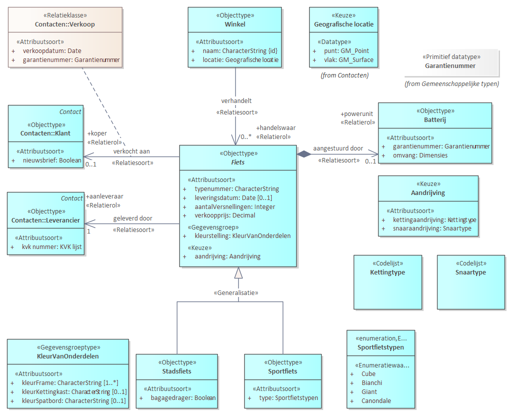

## Wat is UML

Onderstaande leeswijzer is een kopie van de leeswijzer in [MIM-UML](https://github.com/Geonovum/mim-uml/blob/main/Bijlage_leeswijzer-MIM-UML.md).

### UML leeswijzer: Hoe lees je een MIM-UML-klassendiagram?

UML staat voor Unified Modelling Language en is een formele modelleertaal om objectgeoriënteerde analyses, ontwerpen en specificaties voor een informatiesysteem te kunnen maken. UML is een visuele modelleertaal om met behulp van diagrammen verschillende onderdelen van een specificatie te beschrijven. Het UML-klassendiagram is daarvan het diagramtype om de structuur en inhoud van informatie te modelleren: het informatiemodel.

MIM staat voor het Metamodel voor Informatiemodellering en omvat de regels voor het opstellen van een informatiemodel. MIM is opgesteld los van een specifieke modelleertaal. Er zijn wel toepassing voor MIM in specifieke modelleertalen. MIM voor UML is er daar een van.

In deze bijlage wordt beschreven hoe een MIM-UML-klassendiagram gelezen moet worden.
Aan de hand van een model voor de adminstratie van een fietsenwinkel worden de MIM-UML constructies toegelicht.

 "Een MIM-UML klassediagram voor een informatiemodel over de administratie van een fietsenwinkel."

Het 'fietsenwinkelmodel' beschrijft de administratie van een fietsenwinkel. Een `Winkel` verkoopt `Fiets`en.
Een `Winkel` heeft een naam en een locatie.
Een `Fiets` wordt geleverd door een `Leverancier` en verkocht aan een `Klant`.
Een `Fiets` heeft allerlei kenmerken en er zijn twee type fietsen: `Stadsfiets` en `Sportfiets`.

Al deze informatie wordt middels MIM-UML formeel in een informatiemodel vastgelegd. 

Er zijn de volgende MIM-UML constructies:

**Objecttypen**

Elk vak in het diagram met het stereotype «Objecttype» stelt een *objectklasse* (term uit UML) of *objecttype* (term uit MIM) voor.
Een objecttype beschrijft een groep objecten met gedeelde eigenschappen en
gedrag. Een voorbeeld van een objecttype is `Fiets` uit het model voor een fietsenwinkel.

Een *concreet objecttype* stelt een objecttype voor waarvan daadwerkelijk
objecten kunnen worden gemaakt. Dit zijn de typen die in de praktijk gebruikt
worden. In het fietsenwinkelmodel kan dat een objecttype `Sportfiets` of `Stadsfiets` zijn.

Een *abstract objecttype* is bedoeld als een algemene beschrijving en wordt
gebruikt als basis voor andere objecttypen. Er worden geen objecten rechtstreeks
van een abstract type gemaakt. Abstracte objecttypen worden aangeduid met
cursieve namen en hebben een indicatie "abstract" in hun beschrijving.
Voorbeelden in het fietsenwinkelmodel is het objecttype `Fiets` (is cursief). Het komt voor in het model maar alleen om de gezamelijke eigenschappen van een stadsfiets en een sportfiets te groeperen. Het komt niet voor als gegeven in een dataset.
  

**Attributen en gegevensgroepen**

Binnen een objecttype staan attributen («Attribuutsoort») en soms gegevensgroepen («Gegevensgroep»).

*Attributen* zijn de individuele kenmerken van het objecttype.

*Gegevensgroepen* zijn clusters van attributen die samen een logische eenheid
vormen. Bij het objecttype `Fiets` is `kleurstelling` een kenmerk dat als gegevensgroep is opgenomen. Het is beschreven als het «Gegevensgroeptype» `KleurVanOnderdelen`.

Het verschil tussen attributen en gegevensgroepen is zichtbaar via het
*stereotype* «Attribuutsoort» of «Gegevensgroep».

Elk attribuut heeft een *datatype*, zoals onder meer `CharacterString`
(tekstwaarde), `Integer` (geheel getal) of verwijzing naar een waardenlijst, bijvoorbeeld `Sportfietstypen`. Het attribuut en zijn datatype zijn gescheiden door een ':'. Bijvoorbeeld `aantalVersnellingen: Integer`.

**Waardenlijsten**

Waardenlijsten beperken en standaardiseren de mogelijke inhoud van een
attribuut. Er zijn drie soorten waardelijsten: 

*Enumeratie* een vaste waardenlijst die binnen het informatiemodel wordt
beheerd. Wijzigingen vereisen aanpassing van het model.

*Codelijst* is een waardenlijst waarvan de waarden buiten het informatiemodel
worden beheerd, wat flexibiliteit biedt. Wijzigingen leiden niet tot
aanpassingen van het informatiemodel.

*Referentielijst* is een waardelijst waar een structuur in is aangebracht. Bijvoorbeeld een lijst van plaatsnamen en bijbehorende gemeentecodes. Een referentielijst wordt ook buiten het informatiemodel beheerd.

**Relaties tussen objecttypen**

Relaties in een UML-klassendiagram geven de verbindingen tussen objecttypen
weer. Deze relaties verduidelijken de de structuur en interacties binnen het
model. Er zijn een aantal typen relaties met elk een aparte weergave.

*Relatiesoorten* (in UML associaties) zijn relaties tussen objecttypen, die worden weergegeven met
lijnen. Een open pijl geeft de richting van de relatie aan (van bron naar doel).
Voorbeeld: Lijn tussen `Fiets` en `Klant`. Een relatie kan een naam en een relatierol hebben. In het voorbeeld: Een `Fiets` - `geleverd door` - `Leverancier`. Dit geeft aan dat in de administratie van de fietsenwinkel is opgenomen welke fiets door welke aanleveraar (= Leverancier in de rol van aanleveraar) is verkocht.

*Aggregatie* is een relatie waarbij is gespecificeerd dat er een 'deel/geheel' relatie tussen objecttypen is. In het voorbeeld is een `Batterij` een onderdeel van `Fiets`. Het zwarte wiebertje geeft aan dat het een 'compositie aggregatie' betreft: een batterij kan maar bij een fiets horen. Een open wiebertje is een 'gedeelde aggregatie'. In dat geval kan het deel, onderdeel uitmaken van meerdere instanties. Bijvoorbeeld, een persoon kan onderdeel uitmaken van meerdere chat-groepen.

*Generalisaties* zijn relaties die worden weergegeven met een lijn met een holle
driehoek en duiden op een 'is-een'-relatie. Bijvoorbeeld: `Stadsfiets` is een `Fiets`. Of anders gezegd objecttype `Fiets` is een generalisatie van `Stadsfiets`. Ook wordt gezegd dat `Stadsfiets` een *subtype* is van het *supertype* `Fiets`. Het kan zijn dat een supertype niet is opgenomen in het afgebeelde diagram. In dat geval wordt er rechtsbovenin het objecttype aangegeven wat het supertype is. In het voorbeeld `Klant` heeft als niet afgebeeld supertype `Contact`.

*Overerving* is een belangrijk mechanisme bij het lezen van het diagram. Een subtype erft alle eigenschappen van het supertype. In het voorbeeld: een `Stadsfiets` heeft alle eigenschappen (o.a. atttributen) die `Fiets` ook heeft.

*Relatieklasse* is net als relatiesoort een relatie tussen objecttypen. Deze relaties bevatten ook kenmerken. Als voorbeeld: `Fiets` heeft een `verkocht aan` - `koper` relatie met `Klant`. Bij die relatie zijn opgenomen de `verkoopdatum` en het `garantienummer`. 

**Kardinaliteit en verplichting**

Kardinaliteit (of multipliciteit) geeft aan hoeveel voorkomens (instanties) van een
objecttype, attribuut of gegevensgroep mogelijk of vereist zijn.
Veelvoorkomende kardinaliteiten zijn:

-   1: precies één (verplicht).

-   0..1: nul of één (optioneel).

-   1..\*: één of meer (verplicht met minimaal één).

-   0..\*: nul of meer (optioneel, zonder bovengrens).

-   \*: onbepaald aantal.

Als er geen kardinaliteit bij een attribuut of gegevensgroep vermeld staat,
wordt dit beschouwd als verplicht (1).

**Keuze**

Een UML-klassendiagram kan keuzemogelijkheden bevatten. Dit wordt aangegeven met
een stereotype «Keuze».

*keuze-datatypen* geeft aan dat bij een attribuut een keuze gemaakt moet worden tussen verschillende datatypen. Dit wordt vaak gebruikt om een keuze tussen twee of meer geometrietypen te specificeren. In het voorbeeld: `Winkel` heeft een attribuut `locatie` met een datatype `Geografische locatie` die als keuze is gedefinieerd tussen het datatype GM_Point of GM_Surface. Locatie wordt daarmee of door een punt of een vlak weergegeven.

*keuze-attribuuttype* geeft aan dat een kenmerk ingevuld wordt door een keuze uit verschillende attributen. In het voorbeeld: het kenmerk `aandrijving` bij `Fiets` heeft als datatype `Aandrijving` om aan te geven dat er een keuze is tussen het attribuut `kettingaandrijving` met het daarbij behorende `kettingtype` of `snaaraandrijving` met het daarbij behorende `snaartype`.

*keuzerelatie* is een keuze tussen meerdere doelobjecttypen in een relatie.
Bijvoorbeeld, een winkel kan eigendom zijn van een persoon of van een organisatie, maar niet van beide.

**Kleurgebruik UML-diagrammen**

Het kleurgebruik kan de leesbaarheid van UML-diagrammen verduidelijken. Een legenda geeft de betekenis weer. Belangrijk is dat kleuren geen formele betekenis hebben binnen een UML-diagram. 

**Samenvatting**

-	MIM-UML is een toepassing van MIM gebruikmakend van de modelleertaal UML.

-	UML is een formele en visuele taal die mbv afgesproken notaties o.a. in een uml-klassediagram, structuur en inhoud van een informatiemodel specificeert.

-	Met «Stereotypen» worden onderdelen van UML notaties herkenbaar onderscheiden en MIM toepassingen herkenbaar gemaakt.

-   Objecttypen, attributen en relaties vormen de kern van een UML klassediagram.

-   Concreet objecttype: praktisch toepasbare objecten; Abstract objecttype:
    algemene beschrijvingen, bedoeld als basis.

-   Attributen hebben een datatype, zoals CharacterString, Integer of een
    waardenlijst (codelijst of enumeratie).

-   Waardenlijsten standaardiseren waarden; codelijsten zijn extern beheerd,
    enumeraties intern.

-   Lijnen tonen relaties tussen objecttypen; generalisaties tonen
    'is-een' (of subtype-supertype) relatie tussen objecttypen.

-   Kardinaliteit geeft aan hoeveel instanties mogelijk of vereist zijn.

-   Keuzes in datatypen of relaties bieden flexibiliteit binnen het model.

-   Kleurgebruik in UML kan de leesbaarheid van een UML diagram verhogen.

Door deze richtlijnen te volgen, kan een UML-klassendiagram effectief worden
geïnterpreteerd. Voor meer informatie over gegevensmodelering, zie het
[Metamodel voor Informatie Modelering
(MIM)](https://docs.geostandaarden.nl/mim/mim/).
