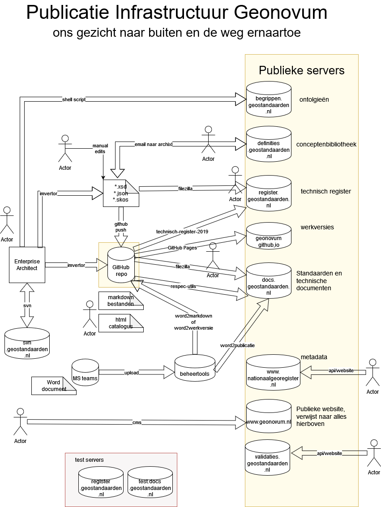

# Welkom

Welkom bij beschrijving van de Geonovum Werkwijze. Dit is een hulpmiddel om
stap voor stap de tooling uit te leggen.

Om onze [standaarden](https://docs.geostandaarden.nl) te beheren, gebruiken we verschillende tools. Deze tools staan in onderstaand overzicht genoemd. Daaronder staat de publicatieomgeving van Geonovum beschreven.

## De tools van Geonovum

- **GitHub**
    - [GitHub handleiding](GitHub.md): Beschrijft hoe je een account aanmaakt en
      je beheertaken uitvoert.
    - [GitHub werkwijze](GitHub-Inleiding.md): Meer algemene inleiding over GitHub.
- **Imvertor**
    - [Imvertor](Imvertor.md): Verwijzingen naar verschillende onderwerpen met   betrekking tot Imvertor.
- **Markdown**
    - [Markdown handleiding](Markdown.md): Handleiding werken met Markdown voor ReSpec-documentatie.
- **ReSpec**
    - [Respec handleiding](ReSpec.md): Algemene handleiding.
    - [Respec checklist](ReSpec-Checklists.md): Checklist van handeling bij het
    publiceren van een standaard middels ReSpec.
    - [Respec code toepassen](ReSpec-code-toepassen.md): Richtlijnen voor het toepassen van code in documentatie.
    - [Respec definitielijst maken](ReSpec-definitielijst-maken.md): Handleiding voor het maken van een definitielijst in ReSpec-documentatie.
- **MIM**
    - [Toolbox importeren](MIM-toolbox-importeren.md): Handleiding voor het importeren van de MIM-toolbox in EA.
    - [Toolbox genereren](MIM-toolbox-genereren.md): Handleiding voor het maken van een EA-toolbox.
    - [Toolbox genereren extensie](MIM-toolbox-genereren-extensie.md): Handleiding voor het maken van een extensie op de MIM-toolbox.
- **Subversion (SVN)**
    - [Subversion instructies](SVN.md): Algemene handleiding
    - [Subversion installeren voor EA](SVN-importeren-bestaand-project): Installatie SVN en informatiemodel in versiebeheer zetten.
    - [Subversion importeren bestaand project](SVN-installeren-voor-EAP): Packages importeren vanuit SVN in EA.
- **EA**
    - [Primitieve datatypes](EA-toepassing-standaarddatatypen.md): Handleiding en toelichting op het toepassen van standaarddatatypes in modelleeromgeving Geonovum.
- **GML**
    - [GML](GML.md): Toelichting GML, XSD en Namespaces.
- **Ontologie**
    - [Ontologie](Handleiding-ontologie-maken-en-publiceren.md): Handleiding voor het maken en publiceren van een ontologie.

## De publicatieomgeving van Geonovum

Verschillende onderdelen van standaarden worden op verschillende plaatsen gepubliceerd. De publicatieomgeving ziet er als volgt uit



### Documenten (docs.geostandaarden.nl)

Standaarden en technische documentatie. Voor een nette lijst van pubdomains op docs.geostandaarden.nl moet de de volgende lijst up-to-date zijn: [pubDomainList.json](https://github.com/Geonovum/respec-utils/blob/master/src/autodeploy/config/pubDomainList.json)

### Het Technisch Register (register.geostandaarden.nl)

Technische onderdelen van de standaard worden op: [register.geostandaarden.nl](https://register.geostandaarden.nl) gezet. Hoe je dit met een webhook kan doen staat beschreven in: [technisch-register-2019](https://github.com/Geonovum/technisch-register-2019/blob/master/documentatie/Handleiding%20voor%20beheerders%20informatiemodellen.md)

### Ontologieën (begrippen.geostandaarden.nl)

### Conceptenbibliotheek (definities.geostandaarden.nl)

## Uitleg MkDocs

[MkDocs](https://www.mkdocs.org/) is een lichtgewicht tool die een collectie
Markdown handleidingen omzet in een navigeerbare handleiding. De markdown bestanden staan in de github repository [handleiding-tooling](https://github.com/Geonovum/handleiding-tooling). Deze wordt automatisch ontsloten op [github pages](https://github.com/Geonovum/handleiding-tooling)

Je kunt mkdocs ook lokaal installeren. Dan kun je live je edits volgen in je browser: [http://127.0.0.1:8000/](http://127.0.0.1:8000/) met het commando:

```
mkdocs serve
```
