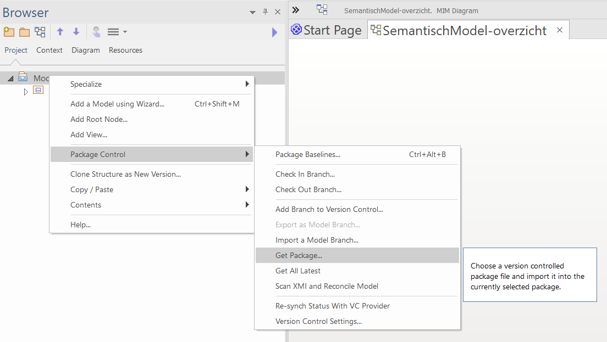

# SVN - Importeren van een bestaand project in EA

Enterprise Architect versie: 15.2

Tortoise SVN Subversion versie: 1.14.1

## Inleiding
Deze handleiding beschrijft hoe je in Enterprise Architect de packages van een bestaand project kunt importeren vanuit Subversion . Het stappenplan laat zien hoe je aan de hand van een EAP-bestand van het IMDiSGeo (`IMSOR-XMI`) een bestaand package toevoegt. In dit voorbeeld wordt het package met [standaarddatatypes](https://geonovum.github.io/uml-datatypen/) toegevoegd. Je kunt ook bestaande packages importeren in een nieuw (leeg) EAP-bestand. De methode is vrijwel identiek. De handleiding licht beide opties toe.

## Inhoud

Dit document bevat de volgende onderdelen: 

 - [Voorbereiding](#voorbereiding)
 - [Stap 1: Configureer de VC-settings](#stap-1-configureer-de-vc-settings)
 - [Stap 2: Haal het _package_ op](#stap-2-haal-het-package-op)
 - [Stap 3: Haal de inhoud van het _package_ op](#stap-3-haal-de-inhoud-van-het-package-op)

## Voorbereiding

### MIM-toolbox importeren
Importeer de MIM-toolbox ([instructie](https://github.com/Geonovum/MIM-Werkomgeving/blob/master/UML%20profieltooling/werkversie1.1.1/README.md#1--importeren-mim-toolbox)). Dit is met name relevant als het bestaande project ontwikkeld is met de MIM-toolbox. Door de toolbox vooraf te importeren, maakt EA automatisch een koppeling met de MIM-modelelementen in de packages die je gaat importeren.

### Lokale folder aanmaken en koppelen
Zie hiervoor **stap 2** en **stap 3** uit de handleiding [SVN - installeren voor EAP](https://github.com/Geonovum/imvertor/blob/main/handleidingen/SVN%20-%20installeren%20voor%20EAP.md#handleiding-voor-het-installeren-van-svn-subversion-voor-een-eap-bestand).

## _Packages_ importeren

### Stap 1: Configureer de VC-settings
Configueer de version control settings van het bestaande project

 - Ga naar `Configure` > `Project-VC`.
 - Er verschijn nu een venster met de naam `Version Control Settings`.
 - Bij een **nieuw EAP-bestand** is dit venster leeg, maar bij een **bestaand EAP-bestand** met packages onder versiebeheer moet je eerst op _New_ klikken (zie onderstaande afbeelding).
 - Doorloop daarna de onderdelen onder de afbeelding.

#### 1.1 Model Settings:
 - Check: "_Save nested version_" [...]

#### 1.2 Configuration Details
 - Check: "_Subversion_"
 - Unique ID: Zelf gekozen unieke aanduiding voor de package onder version control. **Suggestie**: `Geonovum-{naam van het package}`, bijvoorbeeld; `Geonovum-datatypes`, of: `Geonovum-imkl`.
 - Selecteer het _Working Copy Path_ dat je gebruikt voor Subversion. Dit is de folder waar de lokale SVN-gegevens worden weggeschreven (zie: stap 2 bij [lokale folder aanmaken en koppelen](#lokale-folder-aanmaken-en-koppelen)).

#### 1.3 Workstation Settings
 - Selecteer het _Subversion Exe Path_ (de locatie van het bestand: `svn.exe`), als dat nog niet is ingevuld.
 - Klik _Save_

#### 1.4 Defined Configurations
 - Controleer de Defined Configuration. Dit veld heeft nu één (nieuwe) ingevulde regel (zie afbeelding) met de Unique ID die je in [onderdeel 1.2](#12-configuration-details) hebt opgegeven.
 - Klik _Close_

### Stap 2: Haal het _package_ op

 - Klik met rechtermuisknop op _Model_ en ga naar `Package Control` > `Get Package`.
 - Selecteer bij _Select a Version Control Configuration_ in: `Geonovum-datatypes`.
 - Selecteer bij _Select A Shared File For Inclusion_: `Geonovum-algemeen.xml`.

 > **Note**: Kies indien van toepassing het 'hoogtste' _package_ in de hiërarchie van de _package_-structuur van het te importeren bestand. Op deze manier haal je ook in één keer alle subpackages op. 

 > **Note**: Het niveau in de package-structuur van de project browser waar je klikt, bepaalt de plek waar het geimporteerde package terecht komt. Het komt daaronder. kies je model, dan komt het op het 'hoogste' niveau. Dit is soms relevant. Als iets wel, of juist niet onderdeel van het model moet zijn. Ook voor Imvertor is/was dit relevant... (controleren)

In de _Project Browser_ verschijnt nu het _package_ `Geonovum-algemeen` en indien aanwezig inclusief de subpackages. Het kan zijn dat de _packages_ in dit stadium nog leeg zijn. Dat lossen we in de volgende stap op.

### Stap 3: Haal de inhoud van het _package_ op

 > **Note**: Via onderstaande stappen haal je de meest actuele versie op van de packages die onder versiebeheer staan. Als je met verschillende modelleurs aan een package werkt, is het verstandig om deze stappen tussentijds regelmatig uit te voeren.

 - Klik met de rechtermuisknop op een _package_, bijv. `Geonovum-geometrie`.
 - Klik op _Ok_
 - Klik met de rechtermuisknop op het _package_ `Geonovum-geometrie` > `Package Control` > `Get All Latest`.

Er verschijnt een venster _Get All Latest_
 - Selecteer _Import Changed Files Only_ (recommended)
 - Klik _Ok_.

Het _package_ en de _subpackages_ zijn succesvol geïmporteerd. Indien je meerdere basismodellen (of andere typen _packages_) wilt importeren, doorloop je stap 1 t/m 3 opnieuw.

 > **Note**: Het kan zijn dat de packages toch niet goed geïmporteerd worden. Doorloop dan onderstaande stappen.

 - Klik met de rechtermuisknop op het _package_ `«Geonovum-geometrie»`.
 - Klik op _Ok_
 - Klik met de rechtermuisknop op het _package_ `Basismodel` > `Package Control` > `Get Latest`.

Er verschijnt een venster _Import Package_
 - Selecteer _Force reload from XMI_
 - Klik _Ok_.

 

